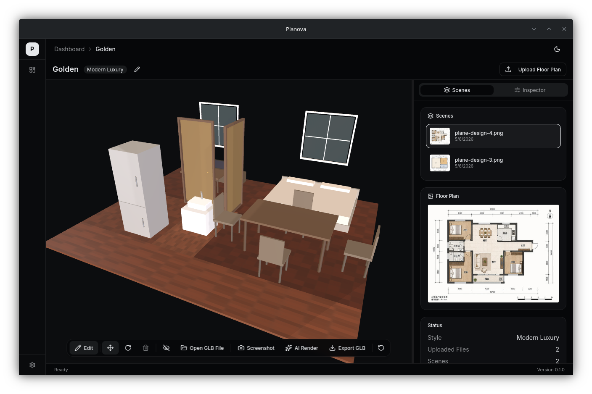

# Planova

**AI Floor Plan to 3D Interior** — Upload a floor plan image, get a walkable 3D room.

Planova is a desktop app that turns 2D floor plan images into interactive 3D interior scenes. Upload a JPG/PNG/PDF floor plan, and the AI parses room geometry, places furniture, and generates a real-time 3D preview you can walk through, edit, and render.



## Features

- **Floor Plan Parsing** — Upload a photo or PDF of a floor plan; AI extracts rooms, walls, doors, and windows
- **Auto Furniture Placement** — AI arranges furniture based on room type and available space
- **3D Viewer** — Real-time Three.js renderer with orbit, walk-through (WASD), and edit modes
- **Scene Inspector** — Structured editor for every element: objects, rooms, walls, materials, lights, cameras. Click a 3D object to highlight it in the inspector, or edit values to update the 3D scene instantly
- **Style Presets** — Modern Luxury, Cream, Nordic, New Chinese, Wabi-Sabi, Industrial
- **AI Rendering** — Generate photorealistic renders from any camera angle with a custom prompt
- **GLB Export** — Export the full scene as a `.glb` file for use in other 3D tools
- **Multi-Language** — English and Chinese UI

## Quick Start

### Prerequisites

- [Node.js](https://nodejs.org/) 20+
- [pnpm](https://pnpm.io/) (recommended) or npm
- [Rust](https://www.rust-lang.org/tools/install) (for the Tauri backend)

### Install & Run

```bash
# Clone the repo
git clone https://github.com/your-username/planova.git
cd planova

# Install frontend dependencies
pnpm install

# Run in development mode (starts both Vite dev server and Tauri window)
pnpm tauri dev
```

### Build for Production

```bash
pnpm tauri build
```

The installer will be in `src-tauri/target/release/bundle/`.

## How It Works

```
Floor Plan Image
      │
      ▼
  AI Vision Model ──→ Room Geometry (JSON)
      │
      ▼
  AI Chat Model ──→ Furniture Layout (JSON)
      │
      ▼
  Three.js Engine ──→ Interactive 3D Scene
      │
      ├── Walk through (WASD)
      ├── Edit objects (drag, rotate, delete)
      ├── Change materials & styles
      └── AI Render / GLB Export
```

The scene is stored as a single `HomeSceneJSON` document containing rooms, walls, openings, objects, materials, lights, and cameras. The Scene Inspector gives you full control over every field.

## Tech Stack

| Layer | Technology |
|-------|-----------|
| Desktop shell | Tauri v2 (Rust) |
| Frontend | React 19, TypeScript, Vite |
| 3D engine | Three.js, React Three Fiber |
| UI | Tailwind CSS v4, shadcn/ui, Radix UI |
| State | Zustand |
| Code editor | CodeMirror 6 |
| i18n | react-i18next |

## Project Structure

```
src/
├── api/              # Tauri IPC wrappers
├── components/
│   ├── ui/           # shadcn/ui primitives
│   └── viewer/       # 3D viewer, inspector, toolbar
├── data/             # Demo scenes, furniture catalog, style palettes
├── engine/           # Three.js scene builder (walls, floors, objects, materials)
├── i18n/             # en-US / zh-CN locale files
├── pages/            # Dashboard, ProjectDetail, Upload, Settings
├── stores/           # Zustand stores (project, scene, viewer, toast)
└── types/            # TypeScript type definitions
src-tauri/
└── src/              # Rust backend (AI calls, file I/O, commands)
```

## License

Apache-2.0
