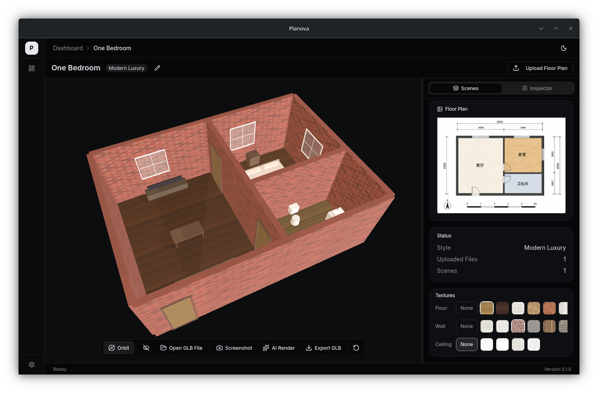

# Planova

**AI 户型图转 3D 室内空间** — 上传一张户型图，获得一个可漫游的 3D 房间。

Planova 是一款桌面应用，能将 2D 户型图转化为可交互的 3D 室内场景。上传 JPG/PNG/PDF 格式的户型图，AI 自动解析房间结构、摆放家具，生成实时 3D 预览，支持漫游、编辑和渲染。



## 功能特性

- **户型图解析** — 上传户型照片或 PDF，AI 自动提取房间、墙体、门窗
- **智能家具布局** — AI 根据房间类型和可用空间自动规划家具摆放
- **3D 浏览器** — 基于 Three.js 的实时渲染，支持轨道浏览、WASD 漫游和编辑模式
- **场景检查器** — 结构化编辑面板，可编辑物体、房间、墙体、材质、灯光、相机等所有元素。点击 3D 物体自动高亮对应卡片，修改数值实时更新 3D 场景
- **风格预设** — 现代轻奢、奶油风、北欧、新中式、侘寂、工业风
- **AI 渲染** — 从任意相机角度生成写实渲染图，支持自定义提示词
- **GLB 导出** — 将完整场景导出为 `.glb` 文件，可在其他 3D 工具中使用
- **多语言** — 支持中文和英文界面

## 快速开始

### 环境要求

- [Node.js](https://nodejs.org/) 20+
- [pnpm](https://pnpm.io/)（推荐）或 npm
- [Rust](https://www.rust-lang.org/tools/install)（Tauri 后端需要）

### 安装与运行

```bash
# 克隆仓库
git clone https://github.com/your-username/planova.git
cd planova

# 安装前端依赖
pnpm install

# 开发模式运行（同时启动 Vite 开发服务器和 Tauri 窗口）
pnpm tauri dev
```

### 生产构建

```bash
pnpm tauri build
```

安装包将生成在 `src-tauri/target/release/bundle/` 目录下。

## 工作流程

```
户型图图片
    │
    ▼
AI 视觉模型 ──→ 房间几何结构（JSON）
    │
    ▼
AI 对话模型 ──→ 家具布局方案（JSON）
    │
    ▼
Three.js 引擎 ──→ 可交互 3D 场景
    │
    ├── 漫游浏览（WASD）
    ├── 编辑物体（拖拽、旋转、删除）
    ├── 更换材质与风格
    └── AI 渲染 / GLB 导出
```

场景以 `HomeSceneJSON` 文档格式存储，包含房间、墙体、门窗、物体、材质、灯光和相机。场景检查器提供对每个字段的完整控制。

## 技术栈

| 层级 | 技术 |
|------|------|
| 桌面端 | Tauri v2（Rust） |
| 前端 | React 19、TypeScript、Vite |
| 3D 引擎 | Three.js、React Three Fiber |
| UI | Tailwind CSS v4、shadcn/ui、Radix UI |
| 状态管理 | Zustand |
| 代码编辑器 | CodeMirror 6 |
| 国际化 | react-i18next |

## 项目结构

```
src/
├── api/              # Tauri IPC 调用封装
├── components/
│   ├── ui/           # shadcn/ui 基础组件
│   └── viewer/       # 3D 浏览器、场景检查器、工具栏
├── data/             # 演示场景、家具目录、风格配色
├── engine/           # Three.js 场景构建器（墙体、地板、物体、材质）
├── i18n/             # 中英文语言文件
├── pages/            # 项目面板、项目详情、上传页、设置页
├── stores/           # Zustand 状态仓库（项目、场景、浏览器、提示）
└── types/            # TypeScript 类型定义
src-tauri/
└── src/              # Rust 后端（AI 调用、文件读写、命令）
```

## 开源协议

Apache-2.0
