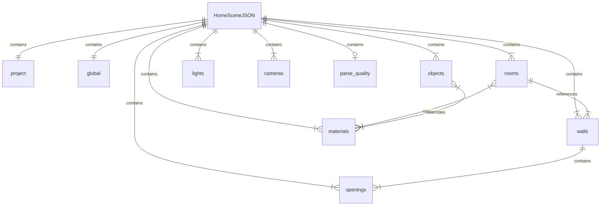

# Data Model — HomeSceneJSON

HomeSceneJSON is the central data structure in Planova. It is the single source of truth that represents a complete interior scene: every room, wall, door, piece of furniture, material, light, and camera position. The AI pipeline produces it, the frontend stores it, and the 3D engine renders from it.

The canonical TypeScript definitions live in `src/types/scene.ts`. The Rust backend holds its own models in `src-tauri/src/models.rs` for persistence and IPC.

## Schema Overview



## Coordinate System

All spatial values in HomeSceneJSON use **meters** as the unit of measurement with a **Y-up** coordinate system:

- **X** -- Left / Right
- **Y** -- Up / Down (vertical axis, height)
- **Z** -- Forward / Backward

Heights are measured along the Y axis. Room polygons (`Vec2`) and wall start/end positions are defined on the XZ plane. Object positions (`Vec3`) include the Y component for elevation above the floor.

## Primitive Types

| Type | Description | Example |
|------|-------------|---------|
| `string` | Text value | `"living_room"` |
| `number` | Floating-point value | `3.6` |
| `boolean` | True/false flag | `true` |
| `Vec2` | 2D vector `[x, z]` | `[4.5, 3.2]` |
| `Vec3` | 3D vector `[x, y, z]` | `[1.0, 2.4, 3.0]` |
| `uuid` | Universally unique identifier string | `"a1b2c3d4-..."` |

---

## Root Document

| Field | Type | Required | Description |
|-------|------|----------|-------------|
| `schema_version` | `string` | Yes | Schema version (e.g., `"1.0"`) |
| `project` | `HomeSceneProject` | Yes | Project metadata |
| `global` | `HomeSceneGlobal` | Yes | Global scene settings |
| `rooms` | `Room[]` | Yes | Room definitions |
| `walls` | `Wall[]` | Yes | Wall segments |
| `openings` | `Opening[]` | Yes | Doors and windows |
| `objects` | `SceneObject[]` | Yes | Furniture and decorative objects |
| `materials` | `SceneMaterial[]` | Yes | PBR material definitions |
| `lights` | `SceneLight[]` | Yes | Light sources |
| `cameras` | `CameraPreset[]` | Yes | Saved camera positions |
| `parse_quality` | `ParseQuality` | No | Pipeline quality metrics (injected by the pipeline) |

---

## `project` — HomeSceneProject

| Field | Type | Description |
|-------|------|-------------|
| `id` | `string` (uuid) | Unique project identifier |
| `name` | `string` | Human-readable project name |
| `unit` | `string` | Measurement unit. Currently always `"meter"` |

---

## `global` — HomeSceneGlobal

| Field | Type | Default | Description |
|-------|------|---------|-------------|
| `style` | `string` | `"modern"` | Interior style preset (e.g., `modern`, `minimalist`, `scandinavian`, `industrial`, `japanese`, `luxury`) |
| `ceiling_height` | `number` | `2.8` | Default ceiling height in meters |
| `wall_thickness` | `number` | `0.15` | Default wall thickness in meters |
| `texture_overrides` | `object` | `undefined` | Optional global texture override map |

### texture_overrides

| Key | Type | Description |
|-----|------|-------------|
| `floor` | `string` | Override texture ID for all floor surfaces |
| `wall` | `string` | Override texture ID for all wall surfaces |
| `ceiling` | `string` | Override texture ID for all ceiling surfaces |

When set, these overrides take precedence over per-room material assignments during scene building.

---

## `rooms[]` — Room

Each room represents a distinct enclosed space identified by the AI pipeline.

| Field | Type | Required | Description |
|-------|------|----------|-------------|
| `id` | `string` (uuid) | Yes | Unique room identifier |
| `type` | `RoomType` | Yes | Room type from the predefined enum |
| `name` | `string` | Yes | Display name (e.g., "Master Bedroom") |
| `polygon` | `Vec2[]` | Yes | Floor polygon vertices on the XZ plane, in winding order |
| `area` | `number` | No | Calculated area in square meters |
| `floor_material` | `string` | No | Material ID for the floor surface |
| `wall_material` | `string` | No | Material ID for room-specific walls |
| `ceiling_material` | `string` | No | Material ID for the ceiling surface |

### RoomType Enum

| Value | Description |
|-------|-------------|
| `living_room` | Primary living/entertainment space |
| `bedroom` | Sleeping quarters |
| `kitchen` | Cooking area with appliance zones |
| `bathroom` | Wet room with plumbing fixtures |
| `dining_room` | Dedicated eating area |
| `balcony` | Outdoor-adjacent extension |
| `corridor` | Circulation hallway |
| `study` | Home office or reading room |

The pipeline assigns material IDs using the pattern `mat_{style}_{surface}_{room_type}` (e.g., `mat_modern_floor_living_room`). The frontend engine resolves these IDs against the `materials[]` array.

---

## `walls[]` — Wall

Walls are defined as line segments on the XZ plane with physical dimensions.

| Field | Type | Required | Description |
|-------|------|----------|-------------|
| `id` | `string` (uuid) | Yes | Unique wall identifier |
| `start` | `Vec2` | Yes | Start point on XZ plane |
| `end` | `Vec2` | Yes | End point on XZ plane |
| `height` | `number` | Yes | Wall height in meters |
| `thickness` | `number` | Yes | Wall thickness in meters |
| `material` | `string` | No | Material ID override for this wall |
| `room_refs` | `string[]` | Yes | IDs of rooms on each side of the wall (typically 1–2) |

---

## `openings[]` — Opening

Openings are cut-outs in walls for doors and windows.

| Field | Type | Required | Description |
|-------|------|----------|-------------|
| `id` | `string` (uuid) | Yes | Unique opening identifier |
| `type` | `OpeningType` | Yes | `"door"` or `"window"` |
| `wall_ref` | `string` (uuid) | Yes | ID of the wall this opening belongs to |
| `position` | `Vec2` | Yes | Position on the XZ plane (center of the opening) |
| `width` | `number` | Yes | Opening width in meters |
| `height` | `number` | Yes | Opening height in meters |
| `sill_height` | `number` | Yes | Height of the bottom edge above floor level (0 for doors) |
| `swing` | `DoorSwing` | No | Door swing direction (only for `type: "door"`) |

### DoorSwing Enum

| Value | Description |
|-------|-------------|
| `left_inward` | Hinged on the left, swings inward |
| `left_outward` | Hinged on the left, swings outward |
| `right_inward` | Hinged on the right, swings inward |
| `right_outward` | Hinged on the right, swings outward |

---

## `objects[]` — SceneObject

All scene objects including furniture, appliances, and decorative items.

| Field | Type | Required | Description |
|-------|------|----------|-------------|
| `id` | `string` (uuid) | Yes | Unique object identifier |
| `type` | `string` | Yes | Object class: `"furniture"` or `"decoration"` |
| `category` | `string` | Yes | Category key matching the furniture catalog (e.g., `"sofa"`, `"bed"`, `"dining_table"`) |
| `asset_id` | `string` | No | External asset reference (unused for procedural objects) |
| `room_ref` | `string` (uuid) | No | ID of the room this object is placed in |
| `position` | `Vec3` | Yes | World-space position in meters |
| `rotation` | `Vec3` | Yes | Euler rotation in radians `[rx, ry, rz]` |
| `scale` | `Vec3` | Yes | Scale factor `[sx, sy, sz]` (default `[1, 1, 1]`) |
| `size` | `Vec3` | Yes | Bounding box dimensions in meters `[width, height, depth]` |
| `material_overrides` | `Record<string, string>` | No | Per-part material overrides (key = part name, value = material ID) |

The furniture catalog in `src/data/furnitureCatalog.ts` maps category keys to default colors and geometry instructions. The engine's `furnitureModels.ts` builds procedural meshes from these definitions using box, cylinder, and sphere primitives.

---

## `materials[]` — SceneMaterial

Materials define the PBR (physically based rendering) appearance of surfaces.

| Field | Type | Required | Description |
|-------|------|----------|-------------|
| `id` | `string` | Yes | Unique material identifier (referenced by rooms, walls, objects) |
| `type` | `string` | Yes | Always `"pbr"` |
| `name` | `string` | Yes | Display name (e.g., "Light Oak Wood", "Matte White") |
| `base_color` | `string` | Yes | Hex color string (e.g., `"#d1b387"`) |
| `roughness` | `number` | Yes | Surface roughness (0 = mirror, 1 = completely rough) |
| `metalness` | `number` | Yes | Metallic quality (0 = dielectric, 1 = fully metallic) |
| `transparent` | `boolean` | No | Whether the material supports transparency |
| `opacity` | `number` | No | Opacity value (0 = fully transparent, 1 = opaque) |
| `texture_urls` | `object` | No | Texture map references |

### texture_urls

| Key | Type | Description |
|-----|------|-------------|
| `base_color` | `string` | Albedo / base color map URL or `texture://` protocol reference |
| `normal` | `string` | Normal map for surface detail |
| `roughness` | `string` | Roughness map |

When `base_color` uses the `texture://` protocol (e.g., `texture://oak`), the engine generates the texture procedurally on canvas via `proceduralTextures.ts`.

---

## `lights[]` — SceneLight

| Field | Type | Required | Description |
|-------|------|----------|-------------|
| `id` | `string` (uuid) | Yes | Unique light identifier |
| `type` | `LightType` | Yes | Light type (see below) |
| `name` | `string` | Yes | Display name |
| `position` | `Vec3` | Yes | World-space position |
| `rotation` | `Vec3` | Yes | Euler rotation in radians |
| `intensity` | `number` | Yes | Light intensity (units depend on type) |
| `color` | `string` | Yes | Hex color string |
| `size` | `Vec2` | No | Area light dimensions (only for `area` type) |

### LightType Enum

| Value | Description |
|-------|-------------|
| `area` | Rectangular area light |
| `point` | Omnidirectional point light |
| `spot` | Directional spotlight cone |
| `directional` | Parallel rays (sun-like) |

---

## `cameras[]` — CameraPreset

| Field | Type | Required | Description |
|-------|------|----------|-------------|
| `id` | `string` (uuid) | Yes | Unique camera identifier |
| `name` | `string` | Yes | Display name (e.g., "Overview", "Living Room") |
| `type` | `CameraType` | Yes | `"perspective"` or `"orthographic"` |
| `position` | `Vec3` | Yes | Camera world-space position |
| `target` | `Vec3` | Yes | Look-at target position |
| `fov` | `number` | Yes | Field of view in degrees (perspective only) |

---

## `parse_quality` — ParseQuality

Injected by the pipeline after processing. Used by the frontend to display confidence scores and determine whether to show a review dialog.

| Field | Type | Description |
|-------|------|-------------|
| `overall_score` | `number` | Overall quality score (0–1) |
| `geometry_score` | `number` | Wall connectivity, room closure, overlap detection (0–1) |
| `semantic_score` | `number` | Room type classification confidence (0–1) |
| `scale_score` | `number` | Real-world scale detection confidence (0–1) |
| `image_alignment_score` | `number` | IoU between CV wall mask and rendered geometry (0–1) |
| `needs_user_review` | `boolean` | `true` if quality scores fall below thresholds |
| `image_alignment` | `ImageAlignmentReport` | Detailed alignment diagnostics (hybrid pipeline only) |

### ImageAlignmentReport

| Field | Type | Description |
|-------|------|-------------|
| `wall_iou` | `number` | Intersection over union of wall regions |
| `wall_precision` | `number` | Fraction of detected walls that match the image |
| `wall_recall` | `number` | Fraction of image walls that were detected |
| `overall` | `number` | Combined alignment score |

---

## Complete Example

```json
{
  "schema_version": "1.0",
  "project": {
    "id": "f47ac10b-58cc-4372-a567-0e02b2c3d479",
    "name": "Modern Apartment",
    "unit": "meter"
  },
  "global": {
    "style": "modern",
    "ceiling_height": 2.8,
    "wall_thickness": 0.15,
    "texture_overrides": {
      "floor": "oak",
      "wall": "white_plaster"
    }
  },
  "rooms": [
    {
      "id": "room-001",
      "type": "living_room",
      "name": "Living Room",
      "polygon": [
        [0, 0],
        [5.5, 0],
        [5.5, 4.2],
        [0, 4.2]
      ],
      "area": 23.1,
      "floor_material": "mat_modern_floor_living_room",
      "wall_material": "mat_modern_wall",
      "ceiling_material": "mat_modern_ceiling"
    },
    {
      "id": "room-002",
      "type": "bedroom",
      "name": "Master Bedroom",
      "polygon": [
        [5.5, 0],
        [9.0, 0],
        [9.0, 4.2],
        [5.5, 4.2]
      ],
      "area": 14.7,
      "floor_material": "mat_modern_floor_bedroom",
      "wall_material": "mat_modern_wall",
      "ceiling_material": "mat_modern_ceiling"
    },
    {
      "id": "room-003",
      "type": "kitchen",
      "name": "Kitchen",
      "polygon": [
        [0, 4.2],
        [3.8, 4.2],
        [3.8, 7.5],
        [0, 7.5]
      ],
      "area": 12.54,
      "floor_material": "mat_modern_floor_kitchen",
      "wall_material": "mat_modern_wall",
      "ceiling_material": "mat_modern_ceiling"
    },
    {
      "id": "room-004",
      "type": "bathroom",
      "name": "Bathroom",
      "polygon": [
        [3.8, 4.2],
        [5.8, 4.2],
        [5.8, 7.5],
        [3.8, 7.5]
      ],
      "area": 6.6,
      "floor_material": "mat_modern_floor_bathroom",
      "wall_material": "mat_modern_wall",
      "ceiling_material": "mat_modern_ceiling"
    },
    {
      "id": "room-005",
      "type": "corridor",
      "name": "Hallway",
      "polygon": [
        [5.8, 4.2],
        [9.0, 4.2],
        [9.0, 5.2],
        [5.8, 5.2]
      ],
      "area": 3.2,
      "floor_material": "mat_modern_floor_corridor",
      "wall_material": "mat_modern_wall",
      "ceiling_material": "mat_modern_ceiling"
    }
  ],
  "walls": [
    {
      "id": "wall-001",
      "start": [0, 0],
      "end": [9.0, 0],
      "height": 2.8,
      "thickness": 0.15,
      "room_refs": ["room-001", "room-002"]
    },
    {
      "id": "wall-002",
      "start": [5.5, 0],
      "end": [5.5, 4.2],
      "height": 2.8,
      "thickness": 0.15,
      "room_refs": ["room-001", "room-002"]
    },
    {
      "id": "wall-003",
      "start": [0, 0],
      "end": [0, 7.5],
      "height": 2.8,
      "thickness": 0.15,
      "room_refs": ["room-001", "room-003"]
    },
    {
      "id": "wall-004",
      "start": [0, 4.2],
      "end": [9.0, 4.2],
      "height": 2.8,
      "thickness": 0.15,
      "room_refs": ["room-001", "room-003", "room-005"]
    }
  ],
  "openings": [
    {
      "id": "opening-001",
      "type": "door",
      "wall_ref": "wall-002",
      "position": [3.5, 2.1],
      "width": 0.9,
      "height": 2.1,
      "sill_height": 0,
      "swing": "left_inward"
    },
    {
      "id": "opening-002",
      "type": "window",
      "wall_ref": "wall-001",
      "position": [2.5, 0],
      "width": 1.8,
      "height": 1.2,
      "sill_height": 0.9
    },
    {
      "id": "opening-003",
      "type": "door",
      "wall_ref": "wall-004",
      "position": [7.0, 4.2],
      "width": 0.9,
      "height": 2.1,
      "sill_height": 0,
      "swing": "right_inward"
    }
  ],
  "objects": [
    {
      "id": "obj-001",
      "type": "furniture",
      "category": "sofa",
      "room_ref": "room-001",
      "position": [2.5, 0, 2.0],
      "rotation": [0, 0, 0],
      "scale": [1, 1, 1],
      "size": [2.2, 0.85, 0.9]
    },
    {
      "id": "obj-002",
      "type": "furniture",
      "category": "coffee_table",
      "room_ref": "room-001",
      "position": [2.5, 0, 3.2],
      "rotation": [0, 0, 0],
      "scale": [1, 1, 1],
      "size": [1.2, 0.45, 0.6]
    },
    {
      "id": "obj-003",
      "type": "furniture",
      "category": "bed",
      "room_ref": "room-002",
      "position": [7.2, 0, 2.1],
      "rotation": [0, 0, 0],
      "scale": [1, 1, 1],
      "size": [1.8, 0.55, 2.0]
    },
    {
      "id": "obj-004",
      "type": "furniture",
      "category": "dining_table",
      "room_ref": "room-003",
      "position": [1.9, 0, 5.8],
      "rotation": [0, 0, 0],
      "scale": [1, 1, 1],
      "size": [1.6, 0.75, 0.9]
    },
    {
      "id": "obj-005",
      "type": "decoration",
      "category": "plant",
      "room_ref": "room-001",
      "position": [0.5, 0, 0.5],
      "rotation": [0, 0.4, 0],
      "scale": [1, 1, 1],
      "size": [0.4, 1.2, 0.4]
    }
  ],
  "materials": [
    {
      "id": "mat_modern_floor_living_room",
      "type": "pbr",
      "name": "Light Oak Wood",
      "base_color": "#d1b387",
      "roughness": 0.65,
      "metalness": 0.0,
      "texture_urls": {
        "base_color": "texture://oak"
      }
    },
    {
      "id": "mat_modern_wall",
      "type": "pbr",
      "name": "Matte White",
      "base_color": "#f2f2ee",
      "roughness": 0.9,
      "metalness": 0.0
    },
    {
      "id": "mat_modern_ceiling",
      "type": "pbr",
      "name": "Ceiling White",
      "base_color": "#ffffff",
      "roughness": 0.95,
      "metalness": 0.0
    },
    {
      "id": "mat_modern_floor_kitchen",
      "type": "pbr",
      "name": "Light Gray Tile",
      "base_color": "#ccccbe",
      "roughness": 0.3,
      "metalness": 0.0,
      "texture_urls": {
        "base_color": "texture://tile"
      }
    },
    {
      "id": "mat_modern_floor_bathroom",
      "type": "pbr",
      "name": "White Marble Tile",
      "base_color": "#ede8e0",
      "roughness": 0.2,
      "metalness": 0.05,
      "texture_urls": {
        "base_color": "texture://marble"
      }
    }
  ],
  "lights": [
    {
      "id": "light-001",
      "type": "directional",
      "name": "Sun",
      "position": [5, 10, 5],
      "rotation": [-0.5, 0.3, 0],
      "intensity": 0.8,
      "color": "#faf0e8"
    },
    {
      "id": "light-002",
      "type": "point",
      "name": "Living Room Ceiling Light",
      "position": [2.75, 2.6, 2.1],
      "rotation": [0, 0, 0],
      "intensity": 500,
      "color": "#fff2d9"
    },
    {
      "id": "light-003",
      "type": "point",
      "name": "Bedroom Ceiling Light",
      "position": [7.25, 2.6, 2.1],
      "rotation": [0, 0, 0],
      "intensity": 400,
      "color": "#fff2d9"
    }
  ],
  "cameras": [
    {
      "id": "cam-001",
      "name": "Overview",
      "type": "perspective",
      "position": [4.5, 8, 12],
      "target": [4.5, 0, 3.75],
      "fov": 50
    },
    {
      "id": "cam-002",
      "name": "Living Room",
      "type": "perspective",
      "position": [1.5, 1.6, 1.5],
      "target": [4.0, 1.0, 3.0],
      "fov": 60
    }
  ],
  "parse_quality": {
    "overall_score": 0.87,
    "geometry_score": 0.92,
    "semantic_score": 0.88,
    "scale_score": 0.91,
    "image_alignment_score": 0.78,
    "needs_user_review": false,
    "image_alignment": {
      "wall_iou": 0.82,
      "wall_precision": 0.89,
      "wall_recall": 0.76,
      "overall": 0.78
    }
  }
}
```

## Design Principles

### Flat Hierarchy

All entity arrays are defined at the root level. Rooms do not contain walls or objects -- instead, relationships are expressed through references (`room_refs`, `wall_ref`, `room_ref`). This flat structure simplifies serialization, diffing, partial updates, and direct consumption by the Three.js engine.

### Referential Integrity

Cross-references between entities use UUID strings. The engine's `buildScene.ts` resolves these references at build time and silently skips objects with dangling references rather than crashing. The pipeline's `repair.rs` attempts to fix broken references automatically.

### Extensibility

New entity types or fields can be added to the schema without breaking existing consumers. The frontend engine ignores unknown fields and entity types, enabling forward-compatible schema evolution. The `schema_version` field tracks the format for migration purposes.
