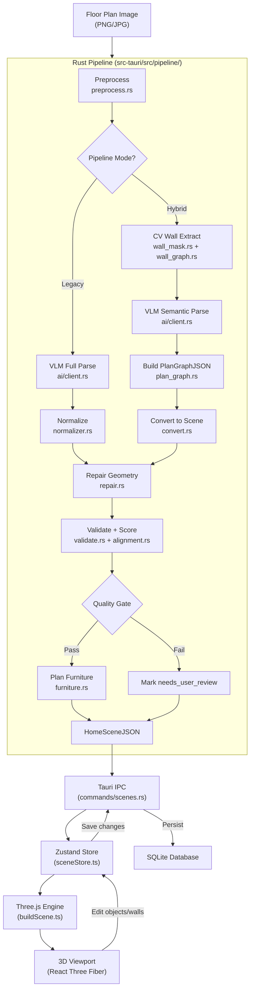

# Architecture Overview

Planova is an AI-powered desktop application that transforms 2D floor plan images into interactive, walkable 3D interior environments. Built with Tauri v2, React, and Three.js, it runs natively on Windows, macOS, and Linux with full offline capability.

## Tech Stack

| Layer | Technology | Version | Purpose |
|-------|-----------|---------|---------|
| Desktop Runtime | Tauri v2 | 2.9 | Native window, IPC, SQLite, file system access |
| Backend | Rust | 1.77+ | Pipeline processing, database, AI integration |
| Frontend Framework | React | 19 | UI rendering, component model |
| Language | TypeScript | 6.0 | Type safety across the frontend |
| Bundler | Vite | 8.0 | Dev server, production builds |
| 3D Engine | Three.js | 0.184 | WebGL scene rendering |
| React 3D Bindings | React Three Fiber | 9.6 | Declarative Three.js in React |
| 3D Helpers | @react-three/drei | 10.7 | Camera controls, environment, helpers |
| CSS Framework | Tailwind CSS | v4 | Utility-first styling |
| State Management | Zustand | 5.0 | Lightweight global stores |
| Code Editor | CodeMirror | 6.0 | In-app JSON editor with syntax highlighting |
| Internationalization | react-i18next | 17.0 | Multi-language support (en-US, zh-CN) |
| Async Runtime | Tokio | 1.x | Async Rust runtime for pipeline and HTTP |
| HTTP Client | reqwest | 0.12 | LLM/VLM API calls |
| Image Processing | image + imageproc | 0.25 | Wall mask extraction, overlays, preprocessing |
| Database | SQLite (rusqlite) | 0.31 | Local project, file, and scene persistence |

## Project Structure

```
planova/
├── src/                          # Frontend (TypeScript / React)
│   ├── api/                      # Tauri IPC invoke wrappers
│   │   ├── files.ts              # File upload, parse trigger, retry
│   │   ├── projects.ts           # Project CRUD
│   │   ├── scenes.ts             # Scene load, save, update
│   │   ├── settings.ts           # LLM/pipeline configuration
│   │   └── tasks.ts              # Generation task polling
│   ├── components/
│   │   ├── layout/               # Topbar, Sidebar, StatusBar
│   │   ├── viewer/               # 3D viewer controls, toolbar
│   │   └── ui/                   # shadcn/ui primitives
│   ├── data/                     # Furniture catalog, test scenes
│   ├── engine/                   # Three.js scene builder
│   │   ├── buildScene.ts         # Orchestrator: HomeSceneJSON → THREE.Group
│   │   ├── buildWalls.ts         # Procedural wall geometry
│   │   ├── buildFloors.ts        # Procedural floor geometry
│   │   ├── buildCeilings.ts      # Procedural ceiling geometry
│   │   ├── buildOpenings.ts      # Door/window cutouts
│   │   ├── buildObjects.ts       # Furniture placement
│   │   ├── furnitureModels.ts    # Procedural furniture mesh generator
│   │   ├── proceduralTextures.ts # Runtime canvas-based texture generation
│   │   ├── materials.ts          # PBR material factory with caching
│   │   ├── shaderMaterials.ts    # Custom GLSL shader materials
│   │   ├── geometryUtils.ts      # Shared geometry helpers
│   │   ├── deleteObject.ts       # Object removal
│   │   └── exportScene.ts        # GLB/OBJ export
│   ├── i18n/locales/             # en-US.json, zh-CN.json
│   ├── lib/                      # Shared utilities
│   ├── pages/                    # Route-level page components
│   │   ├── ProjectDashboard.tsx   # Project list overview
│   │   ├── ProjectDetail.tsx      # Split-pane 3D viewer + editor
│   │   ├── UploadPage.tsx         # Image upload and pipeline trigger
│   │   └── SettingsPage.tsx       # App settings and LLM configuration
│   ├── stores/                   # Zustand state stores
│   │   ├── sceneStore.ts         # HomeSceneJSON state, scene lifecycle
│   │   ├── projectStore.ts       # Project list and active project
│   │   ├── taskStore.ts          # Background task tracking
│   │   ├── viewerStore.ts        # Camera, controls, UI state
│   │   └── toastStore.ts         # Notification queue
│   └── types/
│       ├── scene.ts              # HomeSceneJSON type definitions
│       └── project.ts            # Project-related types
│
├── src-tauri/                    # Backend (Rust)
│   ├── src/
│   │   ├── commands/             # Tauri command handlers (IPC endpoints)
│   │   │   ├── files.rs          # File upload, parse trigger, retry
│   │   │   ├── projects.rs       # Project CRUD against SQLite
│   │   │   ├── scenes.rs         # Scene load/save/update
│   │   │   ├── renders.rs        # Render job management
│   │   │   ├── settings.rs       # LLM config read/write
│   │   │   └── tasks.rs          # Task status polling
│   │   ├── pipeline/             # Floor plan → HomeSceneJSON
│   │   │   ├── mod.rs            # Pipeline orchestrator (legacy + hybrid)
│   │   │   ├── preprocess.rs     # Image preprocessing
│   │   │   ├── wall_mask.rs      # CV-based wall mask extraction
│   │   │   ├── wall_graph.rs     # Wall segment graph from mask
│   │   │   ├── plan_graph.rs     # PlanGraphJSON intermediate format
│   │   │   ├── convert.rs        # PlanGraphJSON → HomeSceneJSON
│   │   │   ├── normalizer.rs     # VLM output → HomeSceneJSON (legacy)
│   │   │   ├── alignment.rs      # Image-to-geometry alignment scoring
│   │   │   ├── overlay.rs        # Debug overlay generation
│   │   │   ├── overlay_alignment.rs # Alignment overlay visualization
│   │   │   ├── repair.rs         # Geometry auto-repair
│   │   │   ├── validate.rs       # Quality validation and scoring
│   │   │   └── furniture.rs      # LLM-based furniture planning
│   │   ├── ai/                   # LLM/VLM integration
│   │   │   ├── client.rs         # HTTP client for vision/language models
│   │   │   ├── prompts.rs        # Prompt templates
│   │   │   └── audit.rs          # Response auditing
│   │   ├── db.rs                 # SQLite schema and queries
│   │   ├── models.rs             # Rust data models (Project, File, Task)
│   │   ├── settings.rs           # App settings persistence
│   │   ├── storage.rs            # File storage on disk
│   │   ├── util.rs               # Shared utilities
│   │   ├── lib.rs                # Tauri app setup and command registration
│   │   └── main.rs               # Entry point
│   └── Cargo.toml
│
└── package.json
```

## Data Flow

The core data flow transforms a floor plan image into an interactive 3D scene through a series of well-defined stages:



### Pipeline Stages

1. **Image Input** -- User uploads a floor plan image (PNG, JPG) through the UploadPage.
2. **Preprocessing** -- The image is cleaned and normalized for downstream processing (`preprocess.rs`).
3. **Pipeline Execution** -- The backend runs one of two pipelines (see below), producing a `HomeSceneJSON` document.
4. **Tauri IPC** -- The JSON crosses the Rust-to-TypeScript boundary via Tauri command handlers.
5. **Zustand Store** -- The frontend receives the JSON and stores it in `sceneStore`, making it reactive.
6. **Three.js Engine** -- `buildScene.ts` reads the store and procedurally generates all geometry (walls, floors, ceilings, openings, furniture).
7. **3D Viewport** -- React Three Fiber renders the scene. User edits in the viewport write back to the store, which can be persisted as updated HomeSceneJSON.

### Pipeline Modes

Planova offers two processing pipelines behind a common `run_pipeline()` entry point in `pipeline/mod.rs`:

**Legacy Pipeline** -- A single VLM (vision-language model) call extracts both geometry (walls, rooms, openings) and semantics (room types, scale) from the image. The output is normalized directly into HomeSceneJSON via `normalizer.rs`. Seven steps: preprocess, VLM parse, normalize, repair, validate, overlay, furniture plan. Simpler but less geometrically precise.

**Hybrid CV+VLM Pipeline** -- Computer vision handles geometry while the VLM handles only semantics:
1. Preprocess image
2. Extract wall mask via CV (`wall_mask.rs`)
3. Build wall segment graph (`wall_graph.rs`)
4. VLM semantic parse (rooms, doors, windows -- geometry already handled by CV)
5. Build PlanGraphJSON intermediate format (`plan_graph.rs`)
6. Convert PlanGraphJSON to HomeSceneJSON (`convert.rs`)
7. Repair geometry
8. Compute image-to-geometry alignment scores (`alignment.rs`)
9. Validate with alignment data
10. Generate debug overlays
11. Quality gate: if scores pass thresholds, plan furniture; otherwise mark `needs_user_review`
12. Save pipeline artifacts

The hybrid pipeline degrades gracefully -- if any CV stage fails (wall mask extraction, wall graph building, or fewer than 3 segments found), it automatically falls back to the legacy pipeline.

### Quality Gate

Before furniture planning runs, the hybrid pipeline checks quality scores:

| Score | Threshold | What it measures |
|-------|-----------|-----------------|
| `geometry_score` | >= 0.8 | Wall connectivity, room closure, no overlaps |
| `scale_score` | >= 0.9 | Real-world scale detection confidence |
| `image_alignment_score` | >= 0.75 | IoU between CV wall mask and rendered geometry |

If any threshold is not met, `needs_user_review` is set to `true` and furniture planning is skipped. The frontend presents a review dialog where the user can accept the result as-is or retry the parse.

## Key Architectural Patterns

### Offline-First

All processing runs locally on the user's machine. The Rust pipeline, image processing, and 3D rendering require no cloud services. The only network dependency is the user-configured LLM/VLM API endpoint (which can be a local model like Ollama). SQLite stores all project data, uploaded files, and scene JSON. No telemetry, no accounts, no required internet connection.

### HomeSceneJSON as Universal Protocol

`HomeSceneJSON` is the single data contract shared between every subsystem. The Rust pipeline produces it, the Zustand store holds it, the Three.js engine consumes it, the CodeMirror editor displays it, and the SQLite persistence layer serializes it. The canonical TypeScript definitions live in `src/types/scene.ts`. Changing the schema there and in the Rust models (`src-tauri/src/models.rs`) is the only place where cross-cutting changes are needed.

### Dual Pipeline Architecture

The legacy and hybrid pipelines coexist behind a common `run_pipeline()` entry point. The hybrid pipeline degrades gracefully -- if any CV stage fails, it falls back to the legacy path automatically. This means the app works with or without the heavier computer vision processing, and users can select their preferred mode in settings.

### Quality-Gated Processing

Every pipeline run produces a `ParseQuality` object with numeric scores and a `needs_user_review` boolean. Downstream stages (furniture planning) only run when quality thresholds are met. The user always sees the quality report and can choose to accept a low-quality result or retry with different settings.

### Procedural Everything

The Three.js engine generates all geometry at runtime from the HomeSceneJSON data. Walls, floors, ceilings, doors, windows, and furniture are all built procedurally in `src/engine/`. Textures are also generated procedurally on canvas (`proceduralTextures.ts`). There are no pre-baked 3D model files -- the only external assets are optional texture URLs in the materials array. This eliminates external asset dependencies, reduces bundle size, and ensures the application works fully offline.

### Bidirectional Editing

The JSON editor (CodeMirror) and the 3D viewport both read from and write to the same Zustand `sceneStore`. Changes in the editor trigger a scene rebuild in the engine, and object manipulations in the 3D viewport update the store, which reflects back into the JSON. An anti-loop mechanism (`lastEditorChange` timestamp in `sceneStore.ts`) prevents infinite update cycles between the two editing surfaces.
