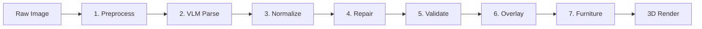
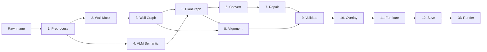

# Pipeline Overview

Planova converts a floor plan image (JPG/PNG) into a walkable 3D interior model. The pipeline supports two modes: a **Legacy** pipeline that relies entirely on a Vision Language Model (VLM), and a **Hybrid CV+VLM** pipeline that uses computer vision for wall geometry and the VLM only for semantic information.

## Pipeline Modes

| Mode | Steps | Geometry Source | Semantic Source | When Used |
|------|-------|----------------|-----------------|-----------|
| Legacy | 7 | VLM | VLM | Default, or when hybrid CV fails |
| Hybrid CV+VLM | 12 | CV (wall mask + skeleton + Hough) | VLM (rooms, doors, windows, scale) | When `pipeline_mode` is set to `hybrid_cv_vlm` |

The mode is selected via `settings::get_pipeline_mode(data_dir)`. If the hybrid pipeline's CV stages fail or produce fewer than 3 wall segments, it automatically falls back to the legacy pipeline.

## Legacy Pipeline (7 Steps)



1. **Preprocess** -- rotation correction, border cropping, size limiting
2. **VLM Parse** -- multimodal vision model extracts rooms, walls, doors, windows, and scale in pixel coordinates
3. **Normalize** -- pixel-to-meter conversion, wall generation, opening binding, material/camera/light generation
4. **Repair** -- vertex snapping, orthogonalization, collinear merging, closure repair
5. **Validate** -- geometry checks, quality scores, review gate
6. **Overlay** -- debug visualization drawn onto the preprocessed image
7. **Furniture** -- LLM-based furniture placement planning

## Hybrid CV+VLM Pipeline (12 Steps)



1. **Preprocess** -- same as legacy
2. **Wall Mask** -- CV: intensity threshold, connected component filtering, floor plan region detection
3. **Wall Graph** -- CV: skeletonization, Hough line detection, merging, endpoint snapping, junction detection
4. **VLM Semantic** -- VLM: room labels/centroids, doors, windows, scale markers (no wall geometry)
5. **PlanGraph** -- merges CV wall segments + VLM semantic data into a unified PlanGraphJSON
6. **Convert** -- converts PlanGraphJSON (pixels) to HomeSceneJSON (meters)
7. **Repair** -- same as legacy
8. **Alignment** -- BFS distance transform comparing CV wall mask to PlanGraph geometry
9. **Validate** -- same checks as legacy, plus image alignment score
10. **Overlay** -- debug overlays for both VLM parsing and alignment
11. **Furniture** -- LLM furniture planning (skipped if quality gate fails)
12. **Save** -- persist all pipeline artifacts

## Fallback Behavior

The hybrid pipeline falls back to legacy in three cases:

1. **Wall mask extraction fails** (e.g., image has no clear dark wall lines)
2. **Wall graph build fails** (skeletonization/Hough produces no lines)
3. **Fewer than 3 CV wall segments** detected (insufficient geometry)

When fallback occurs, the pipeline logs a warning and runs the full legacy pipeline from step 2 onward.

## Pipeline Artifacts

All intermediate artifacts are saved to `data/pipeline/{project_id}/`:

| File | Description | Pipeline Mode |
|------|-------------|---------------|
| `preprocessed.jpg` | Preprocessed image | Both |
| `wall_mask.png` | Binary wall mask from CV | Hybrid |
| `wall_skeleton.png` | Skeletonized wall mask | Hybrid |
| `wall_graph.json` | CV wall segments + junctions | Hybrid |
| `wall_segments.json` | Raw CV wall segments | Hybrid |
| `vlm_response.json` | Raw VLM response JSON | Both |
| `plan_graph.json` | Merged PlanGraphJSON | Hybrid |
| `scene_normalized.json` | Normalized HomeSceneJSON | Both |
| `repair_log.json` | Geometry repair action log | Both |
| `validation_report.json` | Quality validation report | Both |
| `overlay_debug.png` | VLM parsing result overlay | Both |
| `overlay_alignment.png` | Alignment visualization | Hybrid |
| `rendered_structure_mask.png` | PlanGraph geometry rendered as mask | Hybrid |
| `meta.json` | Pipeline metadata | Both |

### meta.json Example

```json
{
  "project_id": "proj_abc123",
  "pipeline_mode": "hybrid_cv_vlm",
  "vlm_stats": {
    "rooms": 4,
    "walls": 0,
    "doors": 2,
    "windows": 2
  },
  "scene_stats": {
    "rooms": 4,
    "walls": 7,
    "objects": 12,
    "materials": 6
  },
  "validation": {
    "score": 0.85,
    "image_alignment_score": 0.82,
    "error_count": 0,
    "warning_count": 1,
    "repair_action_count": 3,
    "needs_user_review": false
  },
  "alignment": {
    "wall_iou": 0.71,
    "wall_precision": 0.88,
    "wall_recall": 0.76,
    "overall": 0.82
  }
}
```

## Source Modules

| Module | File | Responsibility |
|--------|------|----------------|
| `pipeline::preprocess` | `preprocess.rs` | Image preprocessing |
| `pipeline::wall_mask` | `wall_mask.rs` | CV wall mask extraction |
| `pipeline::wall_graph` | `wall_graph.rs` | CV wall graph from skeleton |
| `pipeline::plan_graph` | `plan_graph.rs` | Merging CV + VLM into PlanGraphJSON |
| `pipeline::convert` | `convert.rs` | PlanGraphJSON to HomeSceneJSON |
| `pipeline::normalizer` | `normalizer.rs` | VLM data normalization (legacy) |
| `pipeline::repair` | `repair.rs` | Geometry repair |
| `pipeline::alignment` | `alignment.rs` | Image alignment scoring |
| `pipeline::validate` | `validate.rs` | Quality validation |
| `pipeline::overlay` | `overlay.rs` | Debug overlay generation |
| `pipeline::overlay_alignment` | `overlay_alignment.rs` | Alignment overlay + diagnosis |
| `pipeline::furniture` | `furniture.rs` | LLM furniture planning |
| `ai::client` | `client.rs` | VLM/LLM API calls |
| `ai::prompts` | `prompts.rs` | System and user prompts |
