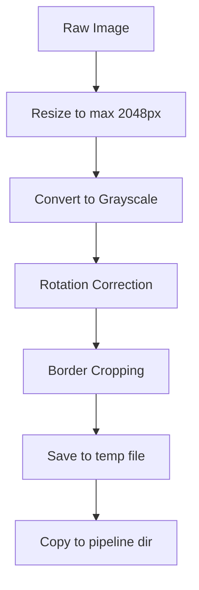

# Image Preprocessing

**Module**: `src-tauri/src/pipeline/preprocess.rs`
**Function**: `preprocess_floor_plan(input_path: &str) -> Result<String, String>`

The preprocessing stage prepares raw floor plan images for downstream parsing. It runs three sequential transformations: rotation correction, border cropping, and size limiting.

## Processing Steps



### Step 1: Resize (Size Limiting)

Limits the longest edge to 2048 pixels using Lanczos3 interpolation. This runs first to cap memory usage before heavier processing.

```rust
fn resize_if_large(img: DynamicImage, max_size: u32) -> DynamicImage
```

- If the longest edge is already &lt;= 2048px, the image passes through unchanged
- Otherwise, scales down proportionally so the longest edge equals 2048px
- Uses `FilterType::Lanczos3` for high-quality downscaling

**Example**: A 3000x2000 image becomes 2048x1365.

### Step 2: Rotation Correction

Corrects slight tilts (within +/-5 degrees) that are common in photographed or scanned floor plans.

**Algorithm**:

1. **Canny edge detection** -- runs on the grayscale image with thresholds (50.0, 150.0)
2. **Gradient angle sampling** -- for each edge pixel, computes a Sobel-like gradient direction
3. **Angle normalization** -- maps angles to near-horizontal/vertical range
4. **Filtering** -- keeps only angles with `|angle| < 5.0` degrees
5. **Median angle** -- computes the median of all collected angles
6. **Rotation transform** -- if median angle &gt;= 0.5 degrees, rotates the image using bilinear interpolation with white fill

```rust
fn correct_rotation(img: DynamicImage, gray: &GrayImage) -> DynamicImage
```

The rotation uses `imageproc::geometric_transformations::rotate_about_center`.

### Step 3: Border Cropping

Removes white borders around the floor plan content area.

**Algorithm**:

1. **Threshold** -- scan all pixels, find those with intensity &lt; 240 (non-white)
2. **Bounding box** -- compute the min/max x/y of all non-white pixels
3. **Padding** -- add 20px padding around the content bounding box
4. **Clamp** -- ensure the crop region stays within image bounds
5. **Safety check** -- skip cropping if the resulting region is smaller than 100x100px

```rust
fn crop_content(img: DynamicImage) -> DynamicImage
```

## Input

Raw floor plan image in any common format (JPG, PNG):

```
data/uploads/project_abc/floorplan.jpg   (3000x2000, 2.5MB)
```

## Output

A preprocessed temporary file, also copied to the pipeline directory:

```
/tmp/planova_processed_{uuid}.jpg        (1800x1200, ~800KB)
data/pipeline/{project_id}/preprocessed.jpg
```

## Implementation Notes

- The grayscale conversion (`to_luma8()`) is used for edge detection and content detection, but the actual transforms are applied to the full RGBA image
- The rotation correction skips processing if the median angle is less than 0.5 degrees (sub-pixel alignment)
- The crop threshold of 240 (out of 255) handles light gray borders but preserves white space within the floor plan that may be part of room interiors
- The 20px crop padding ensures wall lines at the edges of the content area are not clipped
