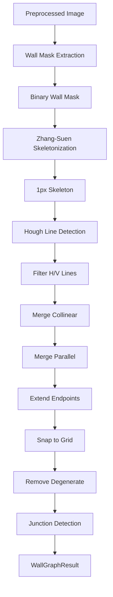

# Wall Detection (CV)

**Modules**: `src-tauri/src/pipeline/wall_mask.rs`, `src-tauri/src/pipeline/wall_graph.rs`

The CV wall detection stage extracts wall geometry from the preprocessed floor plan image using classical computer vision techniques. This runs in the hybrid pipeline only.

## Overview



## Stage A: Wall Mask Extraction

**Module**: `wall_mask.rs`
**Function**: `extract_wall_mask(processed_path, pipeline_dir) -> Result<String>`

Extracts a binary mask isolating wall pixels from the floor plan image.

### Step 1: Intensity Thresholding

Scans all pixels and marks those with intensity &lt; 70 as wall pixels. Walls in Chinese floor plans are drawn in black/dark gray, while colored rooms and annotations have lighter pixels.

```rust
if val < 70 {
    thresholded.put_pixel(x, y, Luma([255]));
}
```

### Step 2: Thickness Filtering

Removes thin components (title block lines, legend dividers) using connected component analysis. Keeps only components whose minimum bounding box dimension &gt;= 5px and area &gt;= 0.03% of total image pixels.

```rust
let min_area = ((w * h) as f64 * 0.0003).max(100.0) as u32;
let wall_only = filter_by_thickness(&thresholded, min_area, 5);
```

### Step 3: Floor Plan Region Detection

Uses sliding window density analysis to find the floor plan's bounding box:

1. Compute row densities (fraction of wall pixels per row)
2. Slide a 30%-height window to find the region with highest cumulative density
3. Expand to include adjacent rows with &gt; 5% of average density
4. Add 5% margin
5. Repeat horizontally within the detected vertical range

This separates the actual floor plan from title blocks, legends, and other annotations.

### Step 4: Morphological Close

Applies a dilate-then-erode operation (radius=1) to bridge tiny gaps where dimension lines cross walls.

### Step 5: Final Connected Component Pass

Runs connected component labeling on the closed image, then keeps only components that:
- Have area &gt;= `min_area`
- Have centroids within the detected floor plan region (with 5% margin)

### Output

Binary mask saved to `data/pipeline/{project_id}/wall_mask.png`.

**Quality checks**:
- Warns if wall pixels &lt; 0.5% of image (may not contain clear walls)
- Warns if wall pixels &gt; 50% of image (threshold too aggressive)

## Stage B: Wall Graph Construction

**Module**: `wall_graph.rs`
**Function**: `build_wall_graph(wall_mask_path, pipeline_dir) -> Result<WallGraphResult>`

Converts the binary wall mask into structured wall segments and junction points.

### Step 1: Zhang-Suen Skeletonization

Reduces the binary mask to 1-pixel-wide centerlines using the Zhang-Suen thinning algorithm.

```rust
fn skeletonize(mask: &GrayImage) -> GrayImage
```

The algorithm iteratively removes border pixels that satisfy two conditions:
- **Condition 1**: `2 <= B(p) <= 6`, `A(p) == 1`, `P2 * P4 * P6 == 0`, `P4 * P6 * P8 == 0`
- **Condition 2**: `2 <= B(p) <= 6`, `A(p) == 1`, `P2 * P4 * P8 == 0`, `P2 * P6 * P8 == 0`

Where `B(p)` is the number of non-zero neighbors, `A(p)` is the number of 0-1 transitions, and P2-P8 are the 8-connected neighbors.

The skeleton is saved to `data/pipeline/{project_id}/wall_skeleton.png`.

### Step 2: Hough Line Detection

Runs Hough line detection on the skeleton image using `imageproc::hough::detect_lines`.

```rust
let options = LineDetectionOptions {
    vote_threshold: max(min_dim / 20, 10),
    suppression_radius: 4,
};
let polar_lines = detect_lines(&img, options);
```

The vote threshold scales with image size (minimum 10 votes).

### Step 3: Filter to Near-H and Near-V Lines

Keeps only lines that are nearly horizontal or vertical:

| Orientation | Angle Range | Rationale |
|-------------|-------------|-----------|
| Horizontal | 82-98 degrees | Hough convention: 90 = horizontal |
| Vertical | 0-8 or 172-180 degrees | Near 0 or 180 |

### Step 4: Find Wall Extent

For each filtered Hough line, scans perpendicular to the line to find the actual extent of wall pixels:

- **Horizontal lines**: scan along X axis at Y = r, checking +/-6px perpendicular
- **Vertical lines**: scan along Y axis at X = r, checking +/-6px perpendicular

Uses `find_longest_run()` to find the longest contiguous run of wall pixels (gap threshold = 10px). Segments shorter than 25px are discarded.

### Step 5: Merge Collinear Segments

Iteratively merges segments that are collinear and close together:

```rust
fn merge_collinear_segments(segments, dist_threshold: 8.0)
```

Two segments can merge if:
- Same orientation (both horizontal or both vertical)
- Perpendicular distance &lt;= 8px
- Overlapping or nearly touching (within 8px along the parallel axis)

The merged segment spans the full range of both inputs.

### Step 6: Merge Parallel Segments

Merges parallel segments that represent opposite edges of the same thick wall into a single centerline:

```rust
fn merge_parallel_segments(segments, dist_threshold: 30.0)
```

Algorithm:
1. Group horizontal segments by Y coordinate, vertical by X coordinate
2. Cluster groups within 30px perpendicular distance
3. Output one centerline segment per cluster (average position, spanning extent)
4. Re-merge collinear segments after parallel merge

### Step 7: Extend Endpoints to Walls

Extends each segment's endpoints to intersect with nearby perpendicular walls:

```rust
fn extend_endpoints_to_walls(segments, max_extension: 250.0)
```

For horizontal segments, extends left/right to reach the nearest vertical wall. For vertical segments, extends up/down to reach the nearest horizontal wall. This ensures wall endpoints meet at corners.

### Step 8: Snap to Grid

Snaps all endpoints to an 8px grid:

```rust
fn snap_endpoints(segments, grid: 8.0)
```

Each coordinate is rounded to the nearest grid point.

### Step 9: Remove Degenerate Segments

Removes segments shorter than 4px after all processing.

### Step 10: Junction Detection

Finds junction points where 2+ segment endpoints are within 12px of each other:

```rust
fn find_junctions(segments, threshold: 12.0)
```

Clusters nearby endpoints and computes the centroid of each cluster as a junction point.

## Output

### WallGraphResult

```rust
pub struct WallGraphResult {
    pub segments: Vec<WallSegment>,
    pub junction_points: Vec<[f64; 2]>,
}
```

### WallSegment

```rust
pub struct WallSegment {
    pub id: String,           // "cv_wall_1", "cv_wall_2", ...
    pub start: [f64; 2],      // [x, y] in pixels
    pub end: [f64; 2],        // [x, y] in pixels
    pub orientation: String,  // "horizontal" or "vertical"
    pub source: String,       // "cv_hough"
    pub confidence: f64,      // always 0.8
}
```

### wall_graph.json Example

```json
{
  "segments": [
    {
      "id": "cv_wall_1",
      "start": [100.0, 50.0],
      "end": [800.0, 50.0],
      "orientation": "horizontal",
      "source": "cv_hough",
      "confidence": 0.8
    },
    {
      "id": "cv_wall_2",
      "start": [100.0, 50.0],
      "end": [100.0, 600.0],
      "orientation": "vertical",
      "source": "cv_hough",
      "confidence": 0.8
    }
  ],
  "junction_points": [
    [100.0, 50.0],
    [800.0, 50.0],
    [100.0, 600.0]
  ]
}
```

Saved to `data/pipeline/{project_id}/wall_graph.json` and `wall_segments.json`.

## Debug Artifacts

| File | Description |
|------|-------------|
| `wall_mask.png` | Binary wall mask |
| `wall_skeleton.png` | 1px skeleton lines |
| `wall_graph.json` | Full WallGraphResult |
| `wall_segments.json` | Raw segment array |
