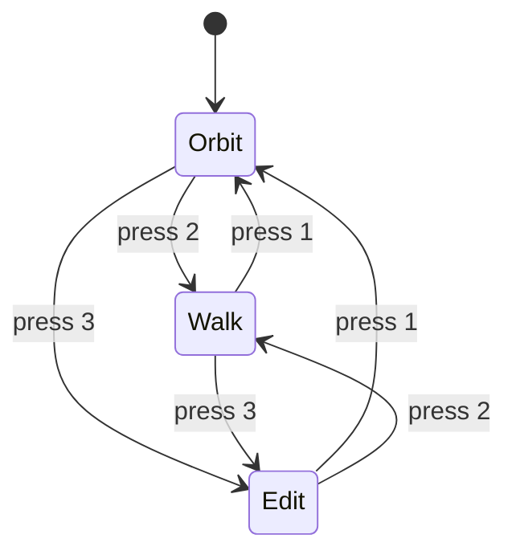

# 3D Viewer

The 3D Viewer is where you explore the generated interior scene. It renders a walkable 3D room using WebGL (Three.js) and provides three interaction modes for different tasks.

## Viewer Modes

Planova offers three modes. Switch between them using the toolbar buttons or keyboard shortcuts.

### 1. Orbit Mode (Default)

The standard camera mode for viewing the scene from above or at an angle.

| Action | Input |
|--------|-------|
| Rotate the camera | Left-click + drag |
| Zoom in/out | Scroll wheel |
| Pan the camera | Right-click + drag |

This mode is best for getting an overview of the room layout, inspecting furniture placement, and framing screenshots.

### 2. Walk Mode

A first-person perspective for experiencing the room as if you were inside it.

| Action | Input |
|--------|-------|
| Move forward / back / left / right | `W` / `S` / `A` / `D` |
| Walk speed | 1.5 m/s (hold `Shift` for 3.0 m/s sprint) |
| Look around | Move the mouse (pointer is locked) |
| Exit pointer lock | Press `Esc` |

:::tip
Click anywhere in the viewer canvas to activate pointer lock. The cursor disappears and mouse movement controls your view direction, giving a natural walk-through feel.
:::

### 3. Edit Mode

For selecting and moving objects in the scene.

| Action | Input |
|--------|-------|
| Select an object | Left-click on it |
| Move the object | Drag the **TransformControls** gizmo handles |
| Rotate the object | Switch the gizmo to rotate mode (see toolbar) |
| Deselect | Click on empty space |

Edit mode is useful for fine-tuning furniture positions and orientations after the initial generation.

## Keyboard Shortcuts

| Key | Action |
|-----|--------|
| `1` | Switch to **Orbit** mode |
| `2` | Switch to **Walk** mode |
| `3` | Switch to **Edit** mode |
| `C` | Toggle ceiling visibility (hide ceilings to see room interiors from above) |
| `R` | Reset camera to the default position and orientation |

## Toolbar

The toolbar sits at the top of the viewer and provides quick access to all major functions.

### Mode Selector

Three buttons (Orbit / Walk / Edit) to switch viewer modes. The active mode is highlighted.

### Edit Tools (Edit Mode Only)

When in Edit mode, additional buttons appear:

- **Translate** -- move objects along axes
- **Rotate** -- rotate objects around axes

### Ceiling Toggle

Show or hide the ceiling meshes. Hiding ceilings gives you a clear top-down view of room interiors, which is especially useful in Orbit mode.

### Open GLB

Load an existing `.glb` file from disk into the viewer. Useful for inspecting exported scenes or third-party 3D models.

### Screenshot

Captures the current WebGL canvas as a PNG image. A native save dialog appears so you can choose where to save the file.

See [Export](./export.md) for details.

### AI Render

Sends the current view screenshot along with a style prompt to the backend for photorealistic rendering. The result opens in your system's default image viewer.

See [Export > AI Render](./export.md#ai-render) for details.

### Export GLB

Exports the full scene as a `.glb` file. A native save dialog lets you pick the destination.

See [Export > GLB Export](./export.md#glb-export) for details.

### Reset Camera

Resets the camera to the initial default position and orientation. Same as pressing `R`.

## Material Panel (Edit Mode)

When you select an object in Edit mode, a **Material Panel** appears in the toolbar area. It shows available materials (textures) for that object type.

- Click a material thumbnail to **apply it** to the selected object.
- The 3D view updates immediately to reflect the change.

This is a quick way to swap floor, wall, or furniture textures without opening the full [Inspector](./inspector.md).
