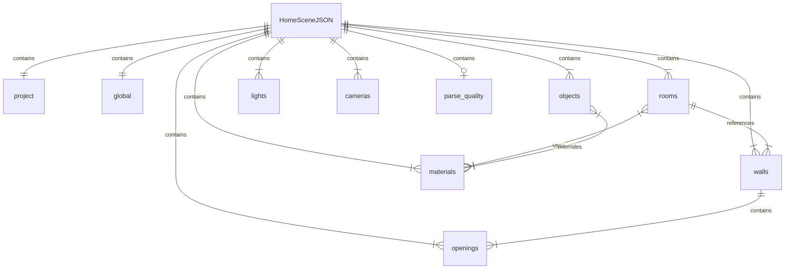

# 数据模型 — HomeSceneJSON

HomeSceneJSON 是 Planova 的核心数据结构。它是表示完整室内场景的唯一事实来源：每个房间、墙体、门、家具、材质、灯光和相机位置。AI 流水线产生它，前端存储它，3D 引擎根据它进行渲染。

规范的 TypeScript 定义位于 `src/types/scene.ts`。Rust 后端在 `src-tauri/src/models.rs` 中维护自己的模型，用于持久化和 IPC。

## Schema 概览



## 坐标系

HomeSceneJSON 中所有空间值使用**米**作为计量单位，采用 **Y 轴向上**的坐标系：

- **X** -- 左 / 右
- **Y** -- 上 / 下（垂直轴，高度）
- **Z** -- 前 / 后

高度沿 Y 轴测量。房间多边形（`Vec2`）和墙体起止位置定义在 XZ 平面上。物体位置（`Vec3`）包含 Y 分量，用于表示距地面的高度。

## 基本类型

| 类型 | 描述 | 示例 |
|------|------|------|
| `string` | 文本值 | `"living_room"` |
| `number` | 浮点值 | `3.6` |
| `boolean` | 布尔标志 | `true` |
| `Vec2` | 2D 向量 `[x, z]` | `[4.5, 3.2]` |
| `Vec3` | 3D 向量 `[x, y, z]` | `[1.0, 2.4, 3.0]` |
| `uuid` | 通用唯一标识符字符串 | `"a1b2c3d4-..."` |

---

## 根文档

| 字段 | 类型 | 必填 | 描述 |
|------|------|------|------|
| `schema_version` | `string` | 是 | Schema 版本（如 `"1.0"`） |
| `project` | `HomeSceneProject` | 是 | 项目元数据 |
| `global` | `HomeSceneGlobal` | 是 | 全局场景设置 |
| `rooms` | `Room[]` | 是 | 房间定义 |
| `walls` | `Wall[]` | 是 | 墙体线段 |
| `openings` | `Opening[]` | 是 | 门和窗 |
| `objects` | `SceneObject[]` | 是 | 家具和装饰物品 |
| `materials` | `SceneMaterial[]` | 是 | PBR 材质定义 |
| `lights` | `SceneLight[]` | 是 | 光源 |
| `cameras` | `CameraPreset[]` | 是 | 保存的相机位置 |
| `parse_quality` | `ParseQuality` | 否 | 流水线质量指标（由流水线注入） |

---

## `project` — HomeSceneProject

| 字段 | 类型 | 描述 |
|------|------|------|
| `id` | `string` (uuid) | 唯一项目标识符 |
| `name` | `string` | 人类可读的项目名称 |
| `unit` | `string` | 计量单位。目前始终为 `"meter"` |

---

## `global` — HomeSceneGlobal

| 字段 | 类型 | 默认值 | 描述 |
|------|------|--------|------|
| `style` | `string` | `"modern"` | 室内风格预设（如 `modern`、`minimalist`、`scandinavian`、`industrial`、`japanese`、`luxury`） |
| `ceiling_height` | `number` | `2.8` | 默认天花板高度（米） |
| `wall_thickness` | `number` | `0.15` | 默认墙体厚度（米） |
| `texture_overrides` | `object` | `undefined` | 可选的全局纹理覆盖映射 |

### texture_overrides

| 键 | 类型 | 描述 |
|----|------|------|
| `floor` | `string` | 覆盖所有地面的纹理 ID |
| `wall` | `string` | 覆盖所有墙面的纹理 ID |
| `ceiling` | `string` | 覆盖所有天花板的纹理 ID |

设置后，这些覆盖在场景构建时优先于每个房间的材质分配。

---

## `rooms[]` — Room

每个房间代表 AI 流水线识别出的一个独立封闭空间。

| 字段 | 类型 | 必填 | 描述 |
|------|------|------|------|
| `id` | `string` (uuid) | 是 | 唯一房间标识符 |
| `type` | `RoomType` | 是 | 来自预定义枚举的房间类型 |
| `name` | `string` | 是 | 显示名称（如 "主卧"） |
| `polygon` | `Vec2[]` | 是 | XZ 平面上的地面多边形顶点，按绕序排列 |
| `area` | `number` | 否 | 计算面积（平方米） |
| `floor_material` | `string` | 否 | 地面材质 ID |
| `wall_material` | `string` | 否 | 房间特定墙面的材质 ID |
| `ceiling_material` | `string` | 否 | 天花板材质 ID |

### RoomType 枚举

| 值 | 描述 |
|----|------|
| `living_room` | 主要起居/娱乐空间 |
| `bedroom` | 卧室 |
| `kitchen` | 带电器区域的厨房 |
| `bathroom` | 带卫浴设施的湿区 |
| `dining_room` | 专用就餐区 |
| `balcony` | 与室外相邻的延伸空间 |
| `corridor` | 通行走廊 |
| `study` | 家庭办公室或书房 |

流水线使用 `mat_{style}_{surface}_{room_type}` 模式分配材质 ID（如 `mat_modern_floor_living_room`）。前端引擎根据 `materials[]` 数组解析这些 ID。

---

## `walls[]` — Wall

墙体定义为 XZ 平面上具有物理尺寸的线段。

| 字段 | 类型 | 必填 | 描述 |
|------|------|------|------|
| `id` | `string` (uuid) | 是 | 唯一墙体标识符 |
| `start` | `Vec2` | 是 | XZ 平面上的起点 |
| `end` | `Vec2` | 是 | XZ 平面上的终点 |
| `height` | `number` | 是 | 墙高（米） |
| `thickness` | `number` | 是 | 墙厚（米） |
| `material` | `string` | 否 | 该墙体的材质 ID 覆盖 |
| `room_refs` | `string[]` | 是 | 墙体两侧的房间 ID（通常 1–2 个） |

---

## `openings[]` — Opening

开洞是墙体上用于门和窗的缺口。

| 字段 | 类型 | 必填 | 描述 |
|------|------|------|------|
| `id` | `string` (uuid) | 是 | 唯一开洞标识符 |
| `type` | `OpeningType` | 是 | `"door"` 或 `"window"` |
| `wall_ref` | `string` (uuid) | 是 | 该开洞所属墙体的 ID |
| `position` | `Vec2` | 是 | XZ 平面上的位置（开洞中心） |
| `width` | `number` | 是 | 开洞宽度（米） |
| `height` | `number` | 是 | 开洞高度（米） |
| `sill_height` | `number` | 是 | 底边距地面的高度（门为 0） |
| `swing` | `DoorSwing` | 否 | 门的开启方向（仅用于 `type: "door"`） |

### DoorSwing 枚举

| 值 | 描述 |
|----|------|
| `left_inward` | 左侧铰链，向内开 |
| `left_outward` | 左侧铰链，向外开 |
| `right_inward` | 右侧铰链，向内开 |
| `right_outward` | 右侧铰链，向外开 |

---

## `objects[]` — SceneObject

所有场景物体，包括家具、电器和装饰品。

| 字段 | 类型 | 必填 | 描述 |
|------|------|------|------|
| `id` | `string` (uuid) | 是 | 唯一物体标识符 |
| `type` | `string` | 是 | 物体类别：`"furniture"` 或 `"decoration"` |
| `category` | `string` | 是 | 匹配家具目录的类别键（如 `"sofa"`、`"bed"`、`"dining_table"`） |
| `asset_id` | `string` | 否 | 外部资源引用（程序化物体未使用） |
| `room_ref` | `string` (uuid) | 否 | 该物体放置所在房间的 ID |
| `position` | `Vec3` | 是 | 世界空间位置（米） |
| `rotation` | `Vec3` | 是 | 欧拉旋转（弧度）`[rx, ry, rz]` |
| `scale` | `Vec3` | 是 | 缩放因子 `[sx, sy, sz]`（默认 `[1, 1, 1]`） |
| `size` | `Vec3` | 是 | 包围盒尺寸（米）`[width, height, depth]` |
| `material_overrides` | `Record<string, string>` | 否 | 按部件的材质覆盖（键 = 部件名称，值 = 材质 ID） |

`src/data/furnitureCatalog.ts` 中的家具目录将类别键映射到默认颜色和几何体指令。引擎的 `furnitureModels.ts` 使用盒体、圆柱和球体基元从这些定义构建程序化网格。

---

## `materials[]` — SceneMaterial

材质定义表面的 PBR（基于物理的渲染）外观。

| 字段 | 类型 | 必填 | 描述 |
|------|------|------|------|
| `id` | `string` | 是 | 唯一材质标识符（被房间、墙体、物体引用） |
| `type` | `string` | 是 | 始终为 `"pbr"` |
| `name` | `string` | 是 | 显示名称（如 "浅橡木"、"哑光白"） |
| `base_color` | `string` | 是 | 十六进制颜色字符串（如 `"#d1b387"`） |
| `roughness` | `number` | 是 | 表面粗糙度（0 = 镜面，1 = 完全粗糙） |
| `metalness` | `number` | 是 | 金属质感（0 = 电介质，1 = 完全金属） |
| `transparent` | `boolean` | 否 | 材质是否支持透明 |
| `opacity` | `number` | 否 | 不透明度（0 = 完全透明，1 = 不透明） |
| `texture_urls` | `object` | 否 | 纹理贴图引用 |

### texture_urls

| 键 | 类型 | 描述 |
|----|------|------|
| `base_color` | `string` | 反照率/基础颜色贴图 URL 或 `texture://` 协议引用 |
| `normal` | `string` | 法线贴图（用于表面细节） |
| `roughness` | `string` | 粗糙度贴图 |

当 `base_color` 使用 `texture://` 协议（如 `texture://oak`）时，引擎通过 `proceduralTextures.ts` 在 canvas 上程序化生成纹理。

---

## `lights[]` — SceneLight

| 字段 | 类型 | 必填 | 描述 |
|------|------|------|------|
| `id` | `string` (uuid) | 是 | 唯一灯光标识符 |
| `type` | `LightType` | 是 | 灯光类型（见下文） |
| `name` | `string` | 是 | 显示名称 |
| `position` | `Vec3` | 是 | 世界空间位置 |
| `rotation` | `Vec3` | 是 | 欧拉旋转（弧度） |
| `intensity` | `number` | 是 | 灯光强度（单位取决于类型） |
| `color` | `string` | 是 | 十六进制颜色字符串 |
| `size` | `Vec2` | 否 | 面光源尺寸（仅用于 `area` 类型） |

### LightType 枚举

| 值 | 描述 |
|----|------|
| `area` | 矩形面光源 |
| `point` | 全向点光源 |
| `spot` | 方向性聚光灯锥 |
| `directional` | 平行光线（类似太阳） |

---

## `cameras[]` — CameraPreset

| 字段 | 类型 | 必填 | 描述 |
|------|------|------|------|
| `id` | `string` (uuid) | 是 | 唯一相机标识符 |
| `name` | `string` | 是 | 显示名称（如 "总览"、"客厅"） |
| `type` | `CameraType` | 是 | `"perspective"` 或 `"orthographic"` |
| `position` | `Vec3` | 是 | 相机世界空间位置 |
| `target` | `Vec3` | 是 | 观察目标位置 |
| `fov` | `number` | 是 | 视野角度（仅用于透视相机） |

---

## `parse_quality` — ParseQuality

由流水线在处理后注入。前端用于显示置信度分数，并决定是否展示审核对话框。

| 字段 | 类型 | 描述 |
|------|------|------|
| `overall_score` | `number` | 整体质量分数（0–1） |
| `geometry_score` | `number` | 墙体连通性、房间封闭性、重叠检测（0–1） |
| `semantic_score` | `number` | 房间类型分类置信度（0–1） |
| `scale_score` | `number` | 真实世界比例检测置信度（0–1） |
| `image_alignment_score` | `number` | CV 墙体蒙版与渲染几何体之间的 IoU（0–1） |
| `needs_user_review` | `boolean` | 质量分数低于阈值时为 `true` |
| `image_alignment` | `ImageAlignmentReport` | 详细对齐诊断（仅 Hybrid 流水线） |

### ImageAlignmentReport

| 字段 | 类型 | 描述 |
|------|------|------|
| `wall_iou` | `number` | 墙体区域的交并比 |
| `wall_precision` | `number` | 检测到的墙体中与图像匹配的比例 |
| `wall_recall` | `number` | 图像中被检测到的墙体比例 |
| `overall` | `number` | 综合对齐分数 |

---

## 完整示例

```json
{
  "schema_version": "1.0",
  "project": {
    "id": "f47ac10b-58cc-4372-a567-0e02b2c3d479",
    "name": "Modern Apartment",
    "unit": "meter"
  },
  "global": {
    "style": "modern",
    "ceiling_height": 2.8,
    "wall_thickness": 0.15,
    "texture_overrides": {
      "floor": "oak",
      "wall": "white_plaster"
    }
  },
  "rooms": [
    {
      "id": "room-001",
      "type": "living_room",
      "name": "Living Room",
      "polygon": [
        [0, 0],
        [5.5, 0],
        [5.5, 4.2],
        [0, 4.2]
      ],
      "area": 23.1,
      "floor_material": "mat_modern_floor_living_room",
      "wall_material": "mat_modern_wall",
      "ceiling_material": "mat_modern_ceiling"
    },
    {
      "id": "room-002",
      "type": "bedroom",
      "name": "Master Bedroom",
      "polygon": [
        [5.5, 0],
        [9.0, 0],
        [9.0, 4.2],
        [5.5, 4.2]
      ],
      "area": 14.7,
      "floor_material": "mat_modern_floor_bedroom",
      "wall_material": "mat_modern_wall",
      "ceiling_material": "mat_modern_ceiling"
    },
    {
      "id": "room-003",
      "type": "kitchen",
      "name": "Kitchen",
      "polygon": [
        [0, 4.2],
        [3.8, 4.2],
        [3.8, 7.5],
        [0, 7.5]
      ],
      "area": 12.54,
      "floor_material": "mat_modern_floor_kitchen",
      "wall_material": "mat_modern_wall",
      "ceiling_material": "mat_modern_ceiling"
    },
    {
      "id": "room-004",
      "type": "bathroom",
      "name": "Bathroom",
      "polygon": [
        [3.8, 4.2],
        [5.8, 4.2],
        [5.8, 7.5],
        [3.8, 7.5]
      ],
      "area": 6.6,
      "floor_material": "mat_modern_floor_bathroom",
      "wall_material": "mat_modern_wall",
      "ceiling_material": "mat_modern_ceiling"
    },
    {
      "id": "room-005",
      "type": "corridor",
      "name": "Hallway",
      "polygon": [
        [5.8, 4.2],
        [9.0, 4.2],
        [9.0, 5.2],
        [5.8, 5.2]
      ],
      "area": 3.2,
      "floor_material": "mat_modern_floor_corridor",
      "wall_material": "mat_modern_wall",
      "ceiling_material": "mat_modern_ceiling"
    }
  ],
  "walls": [
    {
      "id": "wall-001",
      "start": [0, 0],
      "end": [9.0, 0],
      "height": 2.8,
      "thickness": 0.15,
      "room_refs": ["room-001", "room-002"]
    },
    {
      "id": "wall-002",
      "start": [5.5, 0],
      "end": [5.5, 4.2],
      "height": 2.8,
      "thickness": 0.15,
      "room_refs": ["room-001", "room-002"]
    },
    {
      "id": "wall-003",
      "start": [0, 0],
      "end": [0, 7.5],
      "height": 2.8,
      "thickness": 0.15,
      "room_refs": ["room-001", "room-003"]
    },
    {
      "id": "wall-004",
      "start": [0, 4.2],
      "end": [9.0, 4.2],
      "height": 2.8,
      "thickness": 0.15,
      "room_refs": ["room-001", "room-003", "room-005"]
    }
  ],
  "openings": [
    {
      "id": "opening-001",
      "type": "door",
      "wall_ref": "wall-002",
      "position": [3.5, 2.1],
      "width": 0.9,
      "height": 2.1,
      "sill_height": 0,
      "swing": "left_inward"
    },
    {
      "id": "opening-002",
      "type": "window",
      "wall_ref": "wall-001",
      "position": [2.5, 0],
      "width": 1.8,
      "height": 1.2,
      "sill_height": 0.9
    },
    {
      "id": "opening-003",
      "type": "door",
      "wall_ref": "wall-004",
      "position": [7.0, 4.2],
      "width": 0.9,
      "height": 2.1,
      "sill_height": 0,
      "swing": "right_inward"
    }
  ],
  "objects": [
    {
      "id": "obj-001",
      "type": "furniture",
      "category": "sofa",
      "room_ref": "room-001",
      "position": [2.5, 0, 2.0],
      "rotation": [0, 0, 0],
      "scale": [1, 1, 1],
      "size": [2.2, 0.85, 0.9]
    },
    {
      "id": "obj-002",
      "type": "furniture",
      "category": "coffee_table",
      "room_ref": "room-001",
      "position": [2.5, 0, 3.2],
      "rotation": [0, 0, 0],
      "scale": [1, 1, 1],
      "size": [1.2, 0.45, 0.6]
    },
    {
      "id": "obj-003",
      "type": "furniture",
      "category": "bed",
      "room_ref": "room-002",
      "position": [7.2, 0, 2.1],
      "rotation": [0, 0, 0],
      "scale": [1, 1, 1],
      "size": [1.8, 0.55, 2.0]
    },
    {
      "id": "obj-004",
      "type": "furniture",
      "category": "dining_table",
      "room_ref": "room-003",
      "position": [1.9, 0, 5.8],
      "rotation": [0, 0, 0],
      "scale": [1, 1, 1],
      "size": [1.6, 0.75, 0.9]
    },
    {
      "id": "obj-005",
      "type": "decoration",
      "category": "plant",
      "room_ref": "room-001",
      "position": [0.5, 0, 0.5],
      "rotation": [0, 0.4, 0],
      "scale": [1, 1, 1],
      "size": [0.4, 1.2, 0.4]
    }
  ],
  "materials": [
    {
      "id": "mat_modern_floor_living_room",
      "type": "pbr",
      "name": "Light Oak Wood",
      "base_color": "#d1b387",
      "roughness": 0.65,
      "metalness": 0.0,
      "texture_urls": {
        "base_color": "texture://oak"
      }
    },
    {
      "id": "mat_modern_wall",
      "type": "pbr",
      "name": "Matte White",
      "base_color": "#f2f2ee",
      "roughness": 0.9,
      "metalness": 0.0
    },
    {
      "id": "mat_modern_ceiling",
      "type": "pbr",
      "name": "Ceiling White",
      "base_color": "#ffffff",
      "roughness": 0.95,
      "metalness": 0.0
    },
    {
      "id": "mat_modern_floor_kitchen",
      "type": "pbr",
      "name": "Light Gray Tile",
      "base_color": "#ccccbe",
      "roughness": 0.3,
      "metalness": 0.0,
      "texture_urls": {
        "base_color": "texture://tile"
      }
    },
    {
      "id": "mat_modern_floor_bathroom",
      "type": "pbr",
      "name": "White Marble Tile",
      "base_color": "#ede8e0",
      "roughness": 0.2,
      "metalness": 0.05,
      "texture_urls": {
        "base_color": "texture://marble"
      }
    }
  ],
  "lights": [
    {
      "id": "light-001",
      "type": "directional",
      "name": "Sun",
      "position": [5, 10, 5],
      "rotation": [-0.5, 0.3, 0],
      "intensity": 0.8,
      "color": "#faf0e8"
    },
    {
      "id": "light-002",
      "type": "point",
      "name": "Living Room Ceiling Light",
      "position": [2.75, 2.6, 2.1],
      "rotation": [0, 0, 0],
      "intensity": 500,
      "color": "#fff2d9"
    },
    {
      "id": "light-003",
      "type": "point",
      "name": "Bedroom Ceiling Light",
      "position": [7.25, 2.6, 2.1],
      "rotation": [0, 0, 0],
      "intensity": 400,
      "color": "#fff2d9"
    }
  ],
  "cameras": [
    {
      "id": "cam-001",
      "name": "Overview",
      "type": "perspective",
      "position": [4.5, 8, 12],
      "target": [4.5, 0, 3.75],
      "fov": 50
    },
    {
      "id": "cam-002",
      "name": "Living Room",
      "type": "perspective",
      "position": [1.5, 1.6, 1.5],
      "target": [4.0, 1.0, 3.0],
      "fov": 60
    }
  ],
  "parse_quality": {
    "overall_score": 0.87,
    "geometry_score": 0.92,
    "semantic_score": 0.88,
    "scale_score": 0.91,
    "image_alignment_score": 0.78,
    "needs_user_review": false,
    "image_alignment": {
      "wall_iou": 0.82,
      "wall_precision": 0.89,
      "wall_recall": 0.76,
      "overall": 0.78
    }
  }
}
```

## 设计原则

### 扁平层级

所有实体数组均定义在根级别。房间不包含墙体或物体——关系通过引用表达（`room_refs`、`wall_ref`、`room_ref`）。这种扁平结构简化了序列化、差异比较、部分更新，以及 Three.js 引擎的直接消费。

### 引用完整性

实体间的交叉引用使用 UUID 字符串。引擎的 `buildScene.ts` 在构建时解析这些引用，对悬空引用静默跳过而非崩溃。流水线的 `repair.rs` 会尝试自动修复损坏的引用。

### 可扩展性

可以向 schema 添加新的实体类型或字段，而不会破坏现有消费者。前端引擎忽略未知字段和实体类型，实现了前向兼容的 schema 演进。`schema_version` 字段用于跟踪格式版本以便迁移。
