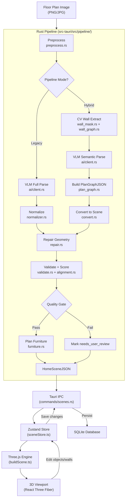

# 架构概览

Planova 是一款 AI 驱动的桌面应用，能够将 2D 户型图转换为交互式、可漫游的 3D 室内环境。基于 Tauri v2、React 和 Three.js 构建，可在 Windows、macOS 和 Linux 上原生运行，并支持完全离线使用。

## 技术栈

| 层级 | 技术 | 版本 | 用途 |
|------|------|------|------|
| 桌面运行时 | Tauri v2 | 2.9 | 原生窗口、IPC、SQLite、文件系统访问 |
| 后端 | Rust | 1.77+ | 流水线处理、数据库、AI 集成 |
| 前端框架 | React | 19 | UI 渲染、组件模型 |
| 编程语言 | TypeScript | 6.0 | 前端全栈类型安全 |
| 构建工具 | Vite | 8.0 | 开发服务器、生产构建 |
| 3D 引擎 | Three.js | 0.184 | WebGL 场景渲染 |
| React 3D 绑定 | React Three Fiber | 9.6 | 在 React 中声明式使用 Three.js |
| 3D 辅助工具 | @react-three/drei | 10.7 | 相机控制、环境、辅助工具 |
| CSS 框架 | Tailwind CSS | v4 | 工具类优先的样式方案 |
| 状态管理 | Zustand | 5.0 | 轻量级全局状态存储 |
| 代码编辑器 | CodeMirror | 6.0 | 应用内 JSON 编辑器，支持语法高亮 |
| 国际化 | react-i18next | 17.0 | 多语言支持（en-US、zh-CN） |
| 异步运行时 | Tokio | 1.x | 异步 Rust 运行时，用于流水线和 HTTP |
| HTTP 客户端 | reqwest | 0.12 | LLM/VLM API 调用 |
| 图像处理 | image + imageproc | 0.25 | 墙体蒙版提取、叠加、预处理 |
| 数据库 | SQLite (rusqlite) | 0.31 | 本地项目、文件和场景持久化 |

## 项目结构

```
planova/
├── src/                          # 前端 (TypeScript / React)
│   ├── api/                      # Tauri IPC invoke 包装器
│   │   ├── files.ts              # 文件上传、解析触发、重试
│   │   ├── projects.ts           # 项目 CRUD
│   │   ├── scenes.ts             # 场景加载、保存、更新
│   │   ├── settings.ts           # LLM/流水线配置
│   │   └── tasks.ts              # 生成任务轮询
│   ├── components/
│   │   ├── layout/               # Topbar、Sidebar、StatusBar
│   │   ├── viewer/               # 3D 查看器控件、工具栏
│   │   └── ui/                   # shadcn/ui 基础组件
│   ├── data/                     # 家具目录、测试场景
│   ├── engine/                   # Three.js 场景构建器
│   │   ├── buildScene.ts         # 编排器：HomeSceneJSON → THREE.Group
│   │   ├── buildWalls.ts         # 程序化墙体几何体
│   │   ├── buildFloors.ts        # 程序化地面几何体
│   │   ├── buildCeilings.ts      # 程序化天花板几何体
│   │   ├── buildOpenings.ts      # 门窗开洞
│   │   ├── buildObjects.ts       # 家具放置
│   │   ├── furnitureModels.ts    # 程序化家具网格生成器
│   │   ├── proceduralTextures.ts # 运行时基于 canvas 的纹理生成
│   │   ├── materials.ts          # PBR 材质工厂（带缓存）
│   │   ├── shaderMaterials.ts    # 自定义 GLSL 着色器材质
│   │   ├── geometryUtils.ts      # 共享几何体辅助函数
│   │   ├── deleteObject.ts       # 物体删除
│   │   └── exportScene.ts        # GLB/OBJ 导出
│   ├── i18n/locales/             # en-US.json、zh-CN.json
│   ├── lib/                      # 共享工具函数
│   ├── pages/                    # 路由级页面组件
│   │   ├── ProjectDashboard.tsx   # 项目列表概览
│   │   ├── ProjectDetail.tsx      # 分栏 3D 查看器 + 编辑器
│   │   ├── UploadPage.tsx         # 图片上传与流水线触发
│   │   └── SettingsPage.tsx       # 应用设置与 LLM 配置
│   ├── stores/                   # Zustand 状态存储
│   │   ├── sceneStore.ts         # HomeSceneJSON 状态、场景生命周期
│   │   ├── projectStore.ts       # 项目列表与当前项目
│   │   ├── taskStore.ts          # 后台任务跟踪
│   │   ├── viewerStore.ts        # 相机、控件、UI 状态
│   │   └── toastStore.ts         # 通知队列
│   └── types/
│       ├── scene.ts              # HomeSceneJSON 类型定义
│       └── project.ts            # 项目相关类型
│
├── src-tauri/                    # 后端 (Rust)
│   ├── src/
│   │   ├── commands/             # Tauri 命令处理器（IPC 端点）
│   │   │   ├── files.rs          # 文件上传、解析触发、重试
│   │   │   ├── projects.rs       # 项目 CRUD（SQLite）
│   │   │   ├── scenes.rs         # 场景加载/保存/更新
│   │   │   ├── renders.rs        # 渲染任务管理
│   │   │   ├── settings.rs       # LLM 配置读写
│   │   │   └── tasks.rs          # 任务状态轮询
│   │   ├── pipeline/             # 户型图 → HomeSceneJSON
│   │   │   ├── mod.rs            # 流水线编排器（Legacy + Hybrid）
│   │   │   ├── preprocess.rs     # 图像预处理
│   │   │   ├── wall_mask.rs      # 基于 CV 的墙体蒙版提取
│   │   │   ├── wall_graph.rs     # 从蒙版构建墙体线段图
│   │   │   ├── plan_graph.rs     # PlanGraphJSON 中间格式
│   │   │   ├── convert.rs        # PlanGraphJSON → HomeSceneJSON
│   │   │   ├── normalizer.rs     # VLM 输出 → HomeSceneJSON（Legacy）
│   │   │   ├── alignment.rs      # 图像与几何体对齐评分
│   │   │   ├── overlay.rs        # 调试叠加图生成
│   │   │   ├── overlay_alignment.rs # 对齐叠加可视化
│   │   │   ├── repair.rs         # 几何体自动修复
│   │   │   ├── validate.rs       # 质量验证与评分
│   │   │   └── furniture.rs      # 基于 LLM 的家具规划
│   │   ├── ai/                   # LLM/VLM 集成
│   │   │   ├── client.rs         # 视觉/语言模型 HTTP 客户端
│   │   │   ├── prompts.rs        # 提示词模板
│   │   │   └── audit.rs          # 响应审计
│   │   ├── db.rs                 # SQLite schema 和查询
│   │   ├── models.rs             # Rust 数据模型（Project、File、Task）
│   │   ├── settings.rs           # 应用设置持久化
│   │   ├── storage.rs            # 磁盘文件存储
│   │   ├── util.rs               # 共享工具函数
│   │   ├── lib.rs                # Tauri 应用初始化与命令注册
│   │   └── main.rs               # 入口点
│   └── Cargo.toml
│
└── package.json
```

## 数据流

核心数据流通过一系列明确定义的阶段，将户型图转换为交互式 3D 场景：



### 流水线阶段

1. **图像输入** -- 用户通过 UploadPage 上传户型图（PNG、JPG）。
2. **预处理** -- 清洗并归一化图像，为下游处理做准备（`preprocess.rs`）。
3. **流水线执行** -- 后端运行两条流水线之一（见下文），生成 `HomeSceneJSON` 文档。
4. **Tauri IPC** -- JSON 通过 Tauri 命令处理器跨越 Rust 到 TypeScript 的边界。
5. **Zustand Store** -- 前端接收 JSON 并存储到 `sceneStore`，使其具有响应性。
6. **Three.js 引擎** -- `buildScene.ts` 读取存储数据，程序化生成所有几何体（墙体、地面、天花板、开洞、家具）。
7. **3D 视口** -- React Three Fiber 渲染场景。用户在视口中的编辑会回写到存储中，可作为更新后的 HomeSceneJSON 持久化。

### 流水线模式

Planova 在 `pipeline/mod.rs` 中的公共 `run_pipeline()` 入口点背后提供两条处理流水线：

**Legacy 流水线** -- 单次 VLM（视觉语言模型）调用从图像中同时提取几何信息（墙体、房间、开洞）和语义信息（房间类型、比例）。输出通过 `normalizer.rs` 直接归一化为 HomeSceneJSON。七个步骤：预处理、VLM 解析、归一化、修复、验证、叠加、家具规划。实现更简单，但几何精度较低。

**Hybrid CV+VLM 流水线** -- 计算机视觉处理几何信息，VLM 仅处理语义信息：
1. 预处理图像
2. 通过 CV 提取墙体蒙版（`wall_mask.rs`）
3. 构建墙体线段图（`wall_graph.rs`）
4. VLM 语义解析（房间、门、窗——几何信息已由 CV 处理）
5. 构建 PlanGraphJSON 中间格式（`plan_graph.rs`）
6. 将 PlanGraphJSON 转换为 HomeSceneJSON（`convert.rs`）
7. 修复几何体
8. 计算图像与几何体对齐分数（`alignment.rs`）
9. 使用对齐数据进行验证
10. 生成调试叠加图
11. 质量门控：如果分数通过阈值，则规划家具；否则标记 `needs_user_review`
12. 保存流水线产物

Hybrid 流水线具有优雅降级能力——如果任何 CV 阶段失败（墙体蒙版提取、墙体线段图构建，或检测到少于 3 个线段），将自动回退到 Legacy 流水线。

### 质量门控

在家具规划运行之前，Hybrid 流水线会检查质量分数：

| 分数 | 阈值 | 衡量内容 |
|------|------|----------|
| `geometry_score` | >= 0.8 | 墙体连通性、房间封闭性、无重叠 |
| `scale_score` | >= 0.9 | 真实世界比例检测置信度 |
| `image_alignment_score` | >= 0.75 | CV 墙体蒙版与渲染几何体之间的 IoU |

如果任何阈值未达标，`needs_user_review` 将被设为 `true`，家具规划将被跳过。前端会展示一个审核对话框，用户可以选择接受当前结果或重新解析。

## 核心架构模式

### 离线优先

所有处理均在用户本机本地运行。Rust 流水线、图像处理和 3D 渲染不需要云服务。唯一的网络依赖是用户配置的 LLM/VLM API 端点（可以是 Ollama 等本地模型）。SQLite 存储所有项目数据、上传文件和场景 JSON。无遥测、无账户、无强制网络连接。

### HomeSceneJSON 作为通用协议

`HomeSceneJSON` 是所有子系统之间共享的唯一数据契约。Rust 流水线产生它，Zustand Store 持有它，Three.js 引擎消费它，CodeMirror 编辑器展示它，SQLite 持久化层序列化它。规范的 TypeScript 定义位于 `src/types/scene.ts`。跨模块变更只需修改该文件和 Rust 模型（`src-tauri/src/models.rs`）。

### 双流水线架构

Legacy 和 Hybrid 流水线共存于公共的 `run_pipeline()` 入口点之后。Hybrid 流水线具有优雅降级能力——如果任何 CV 阶段失败，将自动回退到 Legacy 路径。这意味着应用在有无重量级计算机视觉处理的情况下都能运行，用户可以在设置中选择偏好的模式。

### 质量门控处理

每次流水线运行都会生成一个 `ParseQuality` 对象，包含数值分数和 `needs_user_review` 布尔标志。下游阶段（家具规划）仅在质量阈值达标时运行。用户始终可以看到质量报告，并可选择接受低质量结果或使用不同设置重试。

### 全程序化

Three.js 引擎在运行时根据 HomeSceneJSON 数据生成所有几何体。墙体、地面、天花板、门、窗和家具全部在 `src/engine/` 中程序化构建。纹理也是在 canvas 上程序化生成（`proceduralTextures.ts`）。没有预烘焙的 3D 模型文件——唯一的外部资源是 materials 数组中可选的纹理 URL。这消除了外部资源依赖，减小了包体积，并确保应用完全离线运行。

### 双向编辑

JSON 编辑器（CodeMirror）和 3D 视口都读写同一个 Zustand `sceneStore`。编辑器中的变更会触发引擎中的场景重建，3D 视口中的物体会更新存储，变更会反映回 JSON 中。防循环机制（`sceneStore.ts` 中的 `lastEditorChange` 时间戳）防止两个编辑面之间的无限更新循环。
