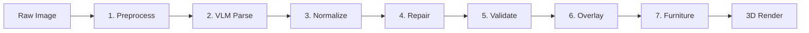
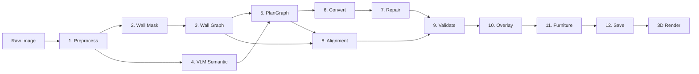

# 流水线概览

Planova 将平面图图像（JPG/PNG）转换为可漫游的 3D 室内模型。流水线支持两种模式：完全依赖视觉语言模型（VLM）的 **Legacy** 流水线，以及使用计算机视觉处理墙体几何、仅用 VLM 提取语义信息的 **Hybrid CV+VLM** 流水线。

## 流水线模式

| 模式 | 步骤数 | 几何来源 | 语义来源 | 适用场景 |
|------|-------|---------|---------|---------|
| Legacy | 7 | VLM | VLM | 默认模式，或 Hybrid CV 失败时使用 |
| Hybrid CV+VLM | 12 | CV（wall mask + skeleton + Hough） | VLM（房间、门窗、比例） | 当 `pipeline_mode` 设置为 `hybrid_cv_vlm` 时 |

模式通过 `settings::get_pipeline_mode(data_dir)` 选择。如果 Hybrid 流水线的 CV 阶段失败或检测到的墙段少于 3 条，将自动回退到 Legacy 流水线。

## Legacy 流水线（7 步）



1. **Preprocess** -- 旋转校正、边框裁剪、尺寸限制
2. **VLM Parse** -- 多模态视觉模型提取房间、墙体、门窗和比例，输出像素坐标
3. **Normalize** -- 像素到米的转换、墙体生成、开口绑定、材质/相机/灯光生成
4. **Repair** -- 顶点吸附、正交化、共线合并、闭合修复
5. **Validate** -- 几何检查、质量评分、审查门控
6. **Overlay** -- 将调试可视化结果绘制到预处理后的图像上
7. **Furniture** -- 基于 LLM 的家具布局规划

## Hybrid CV+VLM 流水线（12 步）



1. **Preprocess** -- 与 Legacy 相同
2. **Wall Mask** -- CV：强度阈值、连通分量过滤、平面图区域检测
3. **Wall Graph** -- CV：skeletonization、Hough 直线检测、合并、端点吸附、交点检测
4. **VLM Semantic** -- VLM：房间标签/质心、门窗、比例标记（不包含墙体几何）
5. **PlanGraph** -- 将 CV 墙段 + VLM 语义数据合并为统一的 PlanGraphJSON
6. **Convert** -- 将 PlanGraphJSON（像素）转换为 HomeSceneJSON（米）
7. **Repair** -- 与 Legacy 相同
8. **Alignment** -- BFS 距离变换，比较 CV wall mask 与 PlanGraph 几何
9. **Validate** -- 与 Legacy 相同的检查项，外加图像对齐评分
10. **Overlay** -- VLM 解析结果和对齐结果的调试叠加图
11. **Furniture** -- LLM 家具规划（质量门控未通过时跳过）
12. **Save** -- 持久化所有流水线产物

## 回退行为

Hybrid 流水线在以下三种情况下会回退到 Legacy：

1. **wall mask 提取失败**（例如图像中没有清晰的深色墙体线条）
2. **wall graph 构建失败**（skeletonization/Hough 未产生直线）
3. **检测到的 CV 墙段少于 3 条**（几何信息不足）

回退发生时，流水线会记录一条警告日志，并从第 2 步开始运行完整的 Legacy 流水线。

## 流水线产物

所有中间产物保存在 `data/pipeline/{project_id}/` 目录下：

| 文件 | 说明 | 流水线模式 |
|------|------|-----------|
| `preprocessed.jpg` | 预处理后的图像 | 两种 |
| `wall_mask.png` | CV 生成的二值墙体掩码 | Hybrid |
| `wall_skeleton.png` | 骨架化后的墙体掩码 | Hybrid |
| `wall_graph.json` | CV 墙段 + 交点 | Hybrid |
| `wall_segments.json` | 原始 CV 墙段 | Hybrid |
| `vlm_response.json` | 原始 VLM 响应 JSON | 两种 |
| `plan_graph.json` | 合并后的 PlanGraphJSON | Hybrid |
| `scene_normalized.json` | 归一化后的 HomeSceneJSON | 两种 |
| `repair_log.json` | 几何修复操作日志 | 两种 |
| `validation_report.json` | 质量验证报告 | 两种 |
| `overlay_debug.png` | VLM 解析结果叠加图 | 两种 |
| `overlay_alignment.png` | 对齐可视化图 | Hybrid |
| `rendered_structure_mask.png` | PlanGraph 几何渲染为掩码 | Hybrid |
| `meta.json` | 流水线元数据 | 两种 |

### meta.json 示例

```json
{
  "project_id": "proj_abc123",
  "pipeline_mode": "hybrid_cv_vlm",
  "vlm_stats": {
    "rooms": 4,
    "walls": 0,
    "doors": 2,
    "windows": 2
  },
  "scene_stats": {
    "rooms": 4,
    "walls": 7,
    "objects": 12,
    "materials": 6
  },
  "validation": {
    "score": 0.85,
    "image_alignment_score": 0.82,
    "error_count": 0,
    "warning_count": 1,
    "repair_action_count": 3,
    "needs_user_review": false
  },
  "alignment": {
    "wall_iou": 0.71,
    "wall_precision": 0.88,
    "wall_recall": 0.76,
    "overall": 0.82
  }
}
```

## 源码模块

| 模块 | 文件 | 职责 |
|------|------|------|
| `pipeline::preprocess` | `preprocess.rs` | 图像预处理 |
| `pipeline::wall_mask` | `wall_mask.rs` | CV 墙体掩码提取 |
| `pipeline::wall_graph` | `wall_graph.rs` | 从骨架构建 CV 墙图 |
| `pipeline::plan_graph` | `plan_graph.rs` | 合并 CV + VLM 为 PlanGraphJSON |
| `pipeline::convert` | `convert.rs` | PlanGraphJSON 转 HomeSceneJSON |
| `pipeline::normalizer` | `normalizer.rs` | VLM 数据归一化（Legacy） |
| `pipeline::repair` | `repair.rs` | 几何修复 |
| `pipeline::alignment` | `alignment.rs` | 图像对齐评分 |
| `pipeline::validate` | `validate.rs` | 质量验证 |
| `pipeline::overlay` | `overlay.rs` | 调试叠加图生成 |
| `pipeline::overlay_alignment` | `overlay_alignment.rs` | 对齐叠加图 + 诊断 |
| `pipeline::furniture` | `furniture.rs` | LLM 家具规划 |
| `ai::client` | `client.rs` | VLM/LLM API 调用 |
| `ai::prompts` | `prompts.rs` | 系统提示词和用户提示词 |
