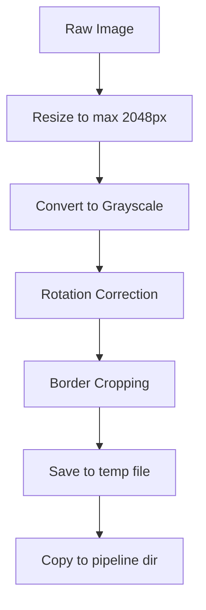

# 图像预处理

**模块**：`src-tauri/src/pipeline/preprocess.rs`
**函数**：`preprocess_floor_plan(input_path: &str) -> Result<String, String>`

预处理阶段对原始平面图图像进行处理，为下游解析做准备。该阶段依次执行三个变换：旋转校正、边框裁剪和尺寸限制。

## 处理步骤



### 第 1 步：缩放（尺寸限制）

使用 Lanczos3 插值将最长边限制为 2048 像素。此步骤最先执行，以在后续重量级处理前限制内存使用。

```rust
fn resize_if_large(img: DynamicImage, max_size: u32) -> DynamicImage
```

- 如果最长边已经 &lt;= 2048px，图像直接通过不做处理
- 否则按比例缩小，使最长边等于 2048px
- 使用 `FilterType::Lanczos3` 进行高质量缩小

**示例**：3000x2000 的图像变为 2048x1365。

### 第 2 步：旋转校正

校正拍照或扫描平面图中常见的轻微倾斜（+/-5 度以内）。

**算法**：

1. **Canny 边缘检测** -- 在灰度图上运行，阈值为 (50.0, 150.0)
2. **梯度角度采样** -- 对每个边缘像素计算类似 Sobel 的梯度方向
3. **角度归一化** -- 将角度映射到近水平/垂直范围
4. **过滤** -- 仅保留 `|angle| < 5.0` 度的角度
5. **中位数角度** -- 计算所有收集角度的中位数
6. **旋转变换** -- 如果中位数角度 &gt;= 0.5 度，使用双线性插值旋转图像，空白区域填充白色

```rust
fn correct_rotation(img: DynamicImage, gray: &GrayImage) -> DynamicImage
```

旋转使用 `imageproc::geometric_transformations::rotate_about_center`。

### 第 3 步：边框裁剪

移除平面图内容区域周围的白色边框。

**算法**：

1. **阈值化** -- 扫描所有像素，找到强度 &lt; 240 的像素（非白色）
2. **边界框** -- 计算所有非白色像素的最小/最大 x/y
3. **内边距** -- 在内容边界框周围添加 20px 的内边距
4. **裁剪限制** -- 确保裁剪区域保持在图像范围内
5. **安全检查** -- 如果裁剪区域小于 100x100px，则跳过裁剪

```rust
fn crop_content(img: DynamicImage) -> DynamicImage
```

## 输入

任意常见格式（JPG、PNG）的原始平面图图像：

```
data/uploads/project_abc/floorplan.jpg   (3000x2000, 2.5MB)
```

## 输出

预处理后的临时文件，同时复制到流水线目录：

```
/tmp/planova_processed_{uuid}.jpg        (1800x1200, ~800KB)
data/pipeline/{project_id}/preprocessed.jpg
```

## 实现说明

- 灰度转换（`to_luma8()`）用于边缘检测和内容检测，但实际变换应用于完整的 RGBA 图像
- 如果中位数角度小于 0.5 度（亚像素对齐），旋转校正会跳过处理
- 240 的裁剪阈值（满值 255）可以处理浅灰色边框，同时保留平面图中可能属于房间内部的白色空间
- 20px 的裁剪内边距确保内容区域边缘的墙体线条不会被裁掉
