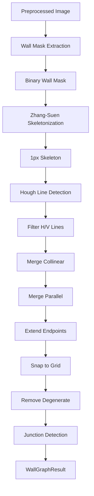

# 墙体检测（CV）

**模块**：`src-tauri/src/pipeline/wall_mask.rs`、`src-tauri/src/pipeline/wall_graph.rs`

CV 墙体检测阶段使用经典计算机视觉技术从预处理后的平面图图像中提取墙体几何。此阶段仅在 Hybrid 流水线中运行。

## 概述



## 阶段 A：墙体掩码提取

**模块**：`wall_mask.rs`
**函数**：`extract_wall_mask(processed_path, pipeline_dir) -> Result<String>`

从平面图图像中提取隔离墙体像素的二值掩码。

### 第 1 步：强度阈值化

扫描所有像素，将强度 &lt; 70 的像素标记为墙体像素。中国平面图中墙体用黑色/深灰色绘制，而彩色房间和标注的像素较亮。

```rust
if val < 70 {
    thresholded.put_pixel(x, y, Luma([255]));
}
```

### 第 2 步：厚度过滤

使用连通分量分析移除细小分量（图框线、图例分隔线）。仅保留最小外接矩形尺寸 &gt;= 5px 且面积 &gt;= 总像素 0.03% 的分量。

```rust
let min_area = ((w * h) as f64 * 0.0003).max(100.0) as u32;
let wall_only = filter_by_thickness(&thresholded, min_area, 5);
```

### 第 3 步：平面图区域检测

使用滑动窗口密度分析查找平面图的边界框：

1. 计算行密度（每行墙体像素的比例）
2. 滑动一个高度 30% 的窗口，找到累积密度最高的区域
3. 扩展到包含密度超过平均密度 5% 的相邻行
4. 添加 5% 的边距
5. 在检测到的垂直范围内重复水平方向的操作

此步骤将实际平面图与图框、图例和其他标注分离。

### 第 4 步：形态学闭运算

执行膨胀再腐蚀操作（半径=1），以弥合尺寸线穿过墙体时产生的微小间隙。

### 第 5 步：最终连通分量处理

对闭运算后的图像运行连通分量标记，然后仅保留满足以下条件的分量：
- 面积 &gt;= `min_area`
- 质心位于检测到的平面图区域内（含 5% 边距）

### 输出

二值掩码保存到 `data/pipeline/{project_id}/wall_mask.png`。

**质量检查**：
- 如果墙体像素 &lt; 图像的 0.5%，发出警告（可能不包含清晰的墙体）
- 如果墙体像素 &gt; 图像的 50%，发出警告（阈值过于激进）

## 阶段 B：墙图构建

**模块**：`wall_graph.rs`
**函数**：`build_wall_graph(wall_mask_path, pipeline_dir) -> Result<WallGraphResult>`

将二值墙体掩码转换为结构化的墙段和交点。

### 第 1 步：Zhang-Suen Skeletonization

使用 Zhang-Suen 细化算法将二值掩码缩减为 1 像素宽的中心线。

```rust
fn skeletonize(mask: &GrayImage) -> GrayImage
```

该算法迭代移除满足两个条件的边界像素：
- **条件 1**：`2 <= B(p) <= 6`，`A(p) == 1`，`P2 * P4 * P6 == 0`，`P4 * P6 * P8 == 0`
- **条件 2**：`2 <= B(p) <= 6`，`A(p) == 1`，`P2 * P4 * P8 == 0`，`P2 * P6 * P8 == 0`

其中 `B(p)` 是非零邻居数量，`A(p)` 是 0-1 转换次数，P2-P8 是 8 连通邻居。

骨架保存到 `data/pipeline/{project_id}/wall_skeleton.png`。

### 第 2 步：Hough 直线检测

使用 `imageproc::hough::detect_lines` 在骨架图像上运行 Hough 直线检测。

```rust
let options = LineDetectionOptions {
    vote_threshold: max(min_dim / 20, 10),
    suppression_radius: 4,
};
let polar_lines = detect_lines(&img, options);
```

投票阈值随图像大小缩放（最低 10 票）。

### 第 3 步：过滤为近水平和近垂直线

仅保留近乎水平或垂直的直线：

| 方向 | 角度范围 | 依据 |
|------|---------|------|
| 水平 | 82-98 度 | Hough 约定：90 = 水平 |
| 垂直 | 0-8 或 172-180 度 | 接近 0 或 180 |

### 第 4 步：查找墙体范围

对每条过滤后的 Hough 线，沿垂直方向扫描以找到墙体像素的实际范围：

- **水平线**：在 Y = r 处沿 X 轴扫描，检查垂直方向 +/-6px
- **垂直线**：在 X = r 处沿 Y 轴扫描，检查垂直方向 +/-6px

使用 `find_longest_run()` 查找墙体像素最长连续段（间隙阈值 = 10px）。短于 25px 的段被丢弃。

### 第 5 步：合并共线段

迭代合并共线且距离接近的段：

```rust
fn merge_collinear_segments(segments, dist_threshold: 8.0)
```

两个段可以合并的条件：
- 方向相同（同为水平或同为垂直）
- 垂直距离 &lt;= 8px
- 重叠或几乎接触（沿平行轴方向在 8px 以内）

合并后的段覆盖两个输入的完整范围。

### 第 6 步：合并平行段

将代表同一面厚墙两侧边缘的平行段合并为单条中心线：

```rust
fn merge_parallel_segments(segments, dist_threshold: 30.0)
```

算法：
1. 按 Y 坐标对水平段分组，按 X 坐标对垂直段分组
2. 在 30px 垂直距离内对组进行聚类
3. 每个聚类输出一条中心线段（平均位置，覆盖范围）
4. 平行合并后重新合并共线段

### 第 7 步：延伸端点到墙体

将每条线段的端点延伸至与最近的垂直墙体相交：

```rust
fn extend_endpoints_to_walls(segments, max_extension: 250.0)
```

对于水平段，向左/右延伸至最近的垂直墙。对于垂直段，向上/下延伸至最近的水平墙。这确保墙体端点在角落处相交。

### 第 8 步：网格吸附

将所有端点吸附到 8px 网格：

```rust
fn snap_endpoints(segments, grid: 8.0)
```

每个坐标四舍五入到最近的网格点。

### 第 9 步：移除退化段

在所有处理后，移除短于 4px 的段。

### 第 10 步：交点检测

查找 2 个以上线段端点在 12px 范围内的交点：

```rust
fn find_junctions(segments, threshold: 12.0)
```

对邻近端点进行聚类，计算每个聚类的质心作为交点。

## 输出

### WallGraphResult

```rust
pub struct WallGraphResult {
    pub segments: Vec<WallSegment>,
    pub junction_points: Vec<[f64; 2]>,
}
```

### WallSegment

```rust
pub struct WallSegment {
    pub id: String,           // "cv_wall_1", "cv_wall_2", ...
    pub start: [f64; 2],      // [x, y] in pixels
    pub end: [f64; 2],        // [x, y] in pixels
    pub orientation: String,  // "horizontal" or "vertical"
    pub source: String,       // "cv_hough"
    pub confidence: f64,      // always 0.8
}
```

### wall_graph.json 示例

```json
{
  "segments": [
    {
      "id": "cv_wall_1",
      "start": [100.0, 50.0],
      "end": [800.0, 50.0],
      "orientation": "horizontal",
      "source": "cv_hough",
      "confidence": 0.8
    },
    {
      "id": "cv_wall_2",
      "start": [100.0, 50.0],
      "end": [100.0, 600.0],
      "orientation": "vertical",
      "source": "cv_hough",
      "confidence": 0.8
    }
  ],
  "junction_points": [
    [100.0, 50.0],
    [800.0, 50.0],
    [100.0, 600.0]
  ]
}
```

保存到 `data/pipeline/{project_id}/wall_graph.json` 和 `wall_segments.json`。

## 调试产物

| 文件 | 说明 |
|------|------|
| `wall_mask.png` | 二值墙体掩码 |
| `wall_skeleton.png` | 1px 骨架线 |
| `wall_graph.json` | 完整的 WallGraphResult |
| `wall_segments.json` | 原始线段数组 |
