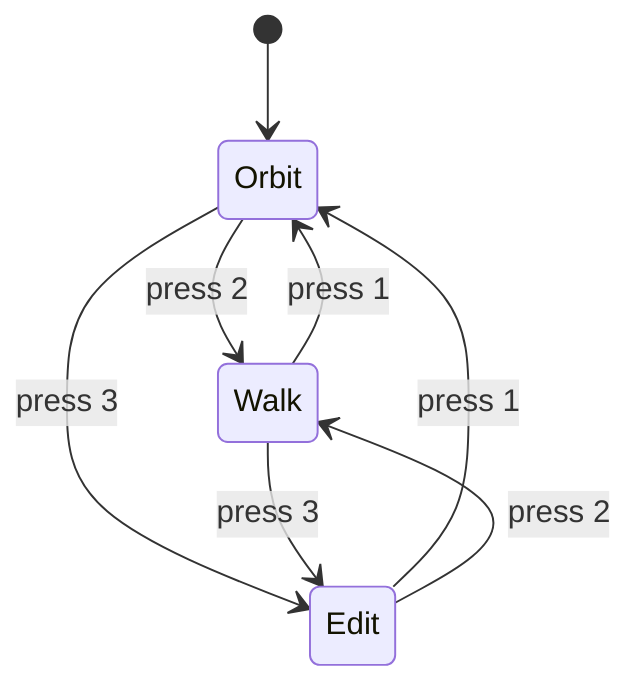

# 3D 查看器

3D 查看器是你浏览生成的室内场景的地方。它使用 WebGL（Three.js）渲染可漫游的 3D 房间，并提供三种交互模式以适应不同任务。

## 查看器模式

Planova 提供三种模式，可通过工具栏按钮或键盘快捷键切换。

### 1. 轨道模式（默认）

用于从上方或斜上方查看场景的标准相机模式。

| 操作 | 输入方式 |
|--------|-------|
| 旋转相机 | 左键拖动 |
| 缩放 | 滚轮 |
| 平移相机 | 右键拖动 |

此模式最适合总览房间布局、检查家具摆放和构图截图。

### 2. 漫游模式

第一人称视角，让你仿佛置身于房间内部。

| 操作 | 输入方式 |
|--------|-------|
| 前进 / 后退 / 左移 / 右移 | `W` / `S` / `A` / `D` |
| 移动速度 | 1.5 m/s（按住 `Shift` 可加速到 3.0 m/s） |
| 环顾四周 | 移动鼠标（指针会被锁定） |
| 退出指针锁定 | 按 `Esc` |

:::tip
点击查看器画布任意位置即可激活指针锁定。光标会消失，鼠标移动将控制视角方向，带来自然的漫游体验。
:::

### 3. 编辑模式

用于选择和移动场景中的物体。

| 操作 | 输入方式 |
|--------|-------|
| 选择物体 | 左键点击 |
| 移动物体 | 拖动 **TransformControls** 控件手柄 |
| 旋转物体 | 将控件切换到旋转模式（见工具栏） |
| 取消选择 | 点击空白区域 |

编辑模式适合在初始生成后微调家具位置和朝向。

## 键盘快捷键

| 按键 | 操作 |
|-----|--------|
| `1` | 切换到 **轨道** 模式 |
| `2` | 切换到 **漫游** 模式 |
| `3` | 切换到 **编辑** 模式 |
| `C` | 切换天花板可见性（隐藏天花板可从上方查看房间内部） |
| `R` | 将相机重置为默认位置和方向 |

## 工具栏

工具栏位于查看器顶部，提供所有主要功能的快捷入口。

### 模式选择器

三个按钮（轨道 / 漫游 / 编辑）用于切换查看器模式，当前活跃的模式会高亮显示。

### 编辑工具（仅编辑模式）

在编辑模式下会显示额外的按钮：

- **移动** -- 沿轴移动物体
- **旋转** -- 绕轴旋转物体

### 天花板切换

显示或隐藏天花板网格。隐藏天花板可以清晰地从上方俯视房间内部，在轨道模式下特别有用。

### 打开 GLB

从磁盘加载现有的 `.glb` 文件到查看器中。适合检查导出的场景或第三方 3D 模型。

### 截图

将当前 WebGL 画布捕获为 PNG 图片。系统会弹出原生保存对话框，让你选择保存位置。

详情参见 [导出](./export.md)。

### AI 渲染

将当前视角截图连同风格提示词发送到后端，进行照片级真实感渲染。渲染结果会在系统默认的图片查看器中打开。

详情参见 [导出 > AI 渲染](./export.md#ai-渲染)。

### 导出 GLB

将完整场景导出为 `.glb` 文件。系统会弹出原生保存对话框，让你选择保存位置。

详情参见 [导出 > GLB 导出](./export.md#glb-导出)。

### 重置相机

将相机重置为初始默认位置和方向，与按 `R` 键效果相同。

## 材质面板（编辑模式）

在编辑模式下选择物体后，工具栏区域会出现 **材质面板**，显示该物体类型可用的材质（纹理）。

- 点击材质缩略图即可将其 **应用** 到选中的物体上。
- 3D 视图会立即更新以反映变化。

这是一种快捷的纹理替换方式，无需打开完整的 [检查器面板](./inspector.md) 即可更换地板、墙面或家具纹理。
